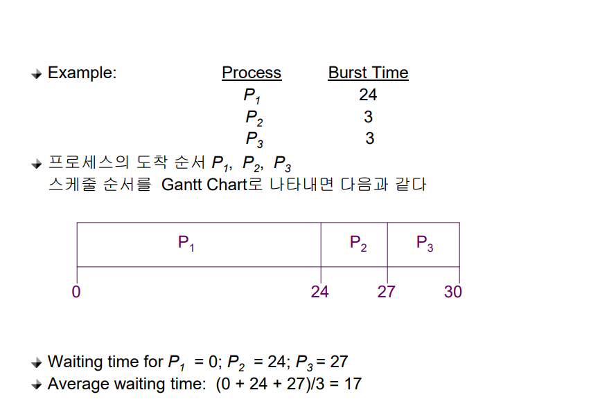
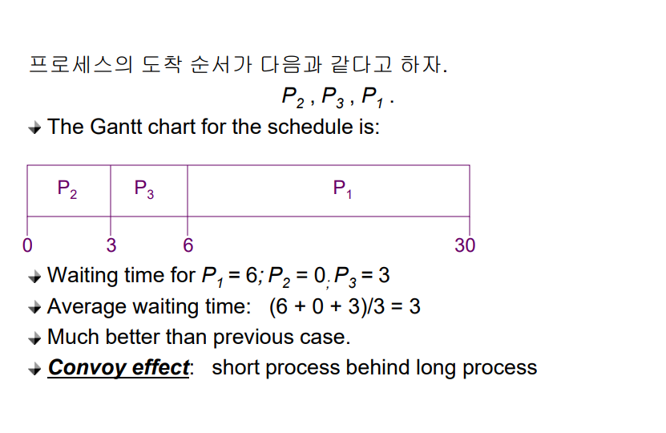
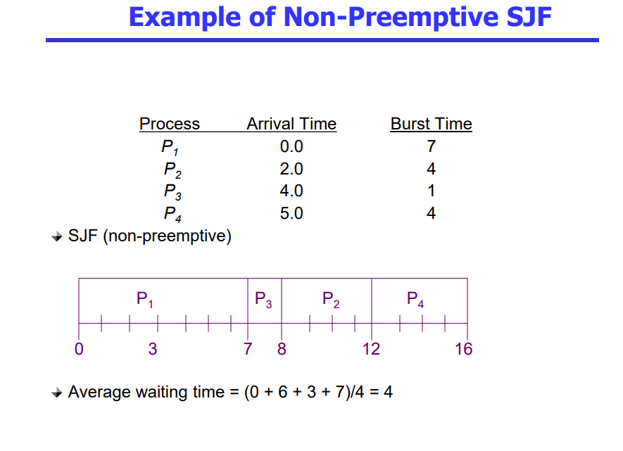
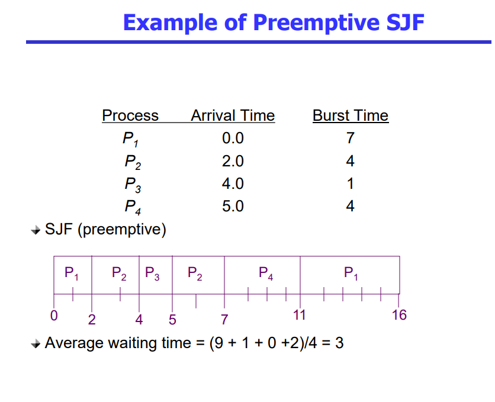
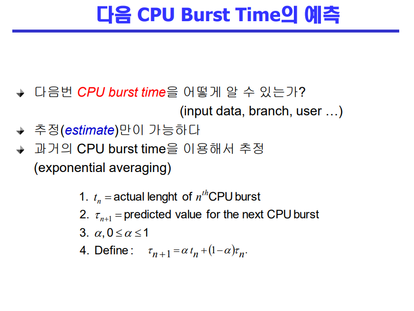
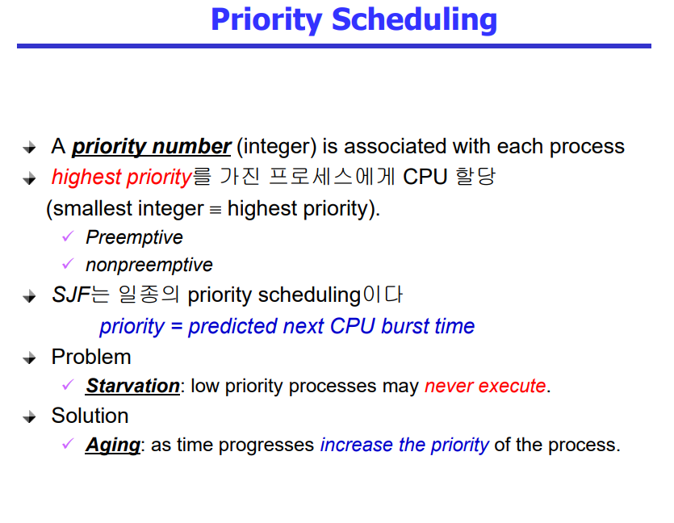
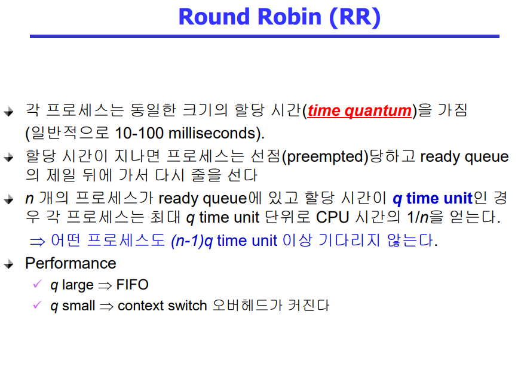

# CPU Scheduling 1

- CPU burst: CPU가 인터럭션 하는 것
- I/O burst: I/O가 인터럭션 하는 것
- CPU를 누구한테 먼저 줄 것 인가?
- CPU를 계속 쓰게 할 것 인가? 뺏어서 다른 프로세스에게 줄 것 인가?
  - 긴 프로세스가 붙잡고 안주면 다른 짧은 프로세스들이 오래 기다리게 된다

 

## CPU Scheduler & Dispatcher
- CPU Scheduler
  - Ready 상태의 프로세스 중에서 이번에 CPU를 줄 프로세스를 고른다

- Dispather
  - CPU의 제어권을 CPU scheduler에 의해 선택된 프로세스에게 넘긴다
  - 이 과정을 문맥 교환이라고 한다

1. nonpreemptive(=비선점형)
2. preemptive(=선점형)

 

## Scheduling Criteria(Performance Index(= Performance Measure, 성능척도))
- 시스템 입장에서 성능척도
  - CPU utilization(이용률)
    - 전체 일한 시간 중에서 CPU가 놀지 않고 일한 시간
    - keep the CPU as busy as possible
  - Throughput(처리량)
    - 주어진 시간 동안 몇 개의 작업을 처리했느냐

- 프로그램 입장(고객 입장)에서 성능척도
  - Turnaround time(소요시간, 반환시간)
  - Waiting time(대기 시간)
  - Response time(응답 시간)

 

## FCFS(First-Come First-Service)(비선점형)
- 선입선출
- 앞에 어떤 프로세스가 있냐에 따라서 기다리는 시간에 상당한 영향을 미치게 됨
- convoy effect

 

## SJF(Shortest-Job-First)
- 각 프로세스의 다음번 CPU burst time을 가지고 스케줄링에 활용
- CPU burst time이 가장 짧은 프로세스를 제일 먼저 스케줄
- Two schemes:
  - 비선점형
    - 일단 CPU를 잡으면 이번 CPU burst가 완료될 때까지 CPU를 선점 당하지 않음
  - 선점형
    - 현재 수행중인 프로세스의 남은 burst time보다 더 짧은 CPU burst time을 가지는 새로운 프로세스가 도착하면 CPU를 빼앗김
    - 이 방법을 Shortest-Remaining-Time-First(SRTF)이라고도 부른다
- SJF is optimal
  - 주어진 프로세스들에 대해 minimum average waiting time을 보장

- Starvation(기아 현상)
  - CPU 사용시간이 긴 프로세스들은 영원히 못 받을 수도 있다 
- CPU 사용시간을 미리 알 수 없다는 것
  - 예측을 함(과거에 얼마나 썼는가로)

 

## Priority Scheduling
- 우선순위가 높은 프로세스에게 CPU를 할당하겠다
- 비선점형
  - 더 높은 우선 순위의 프로세스가 들어왔을때 뺏지 않고 끝까지 완료하면
- 선점형
  - 더 높은 우선 순위의 프로세스가 들어왔을때 뺏는다면

- Solution
  - Aging(노화): 오래기다리면 우선순위를 높여 주자

## Round Robin(RR)
- 각 프로세스는 동일한 크기의 할당 시간(time quantum)을 가짐(일반적으로 10-100 milliseconds)
- 굳이 예측할 필요 없이 프로세스가 빠르게 CPU를 받을 수 있다
- CPU를 쓰는 시간 만큼 비례해서 대기 시간이 길어짐
- 일반적으로 SJF보다 average turnaroud time이 길지만 response time은 더 짧다

## 질문
1. SJF가 무엇이고 문제점이 무엇이 있는지 말해보시오