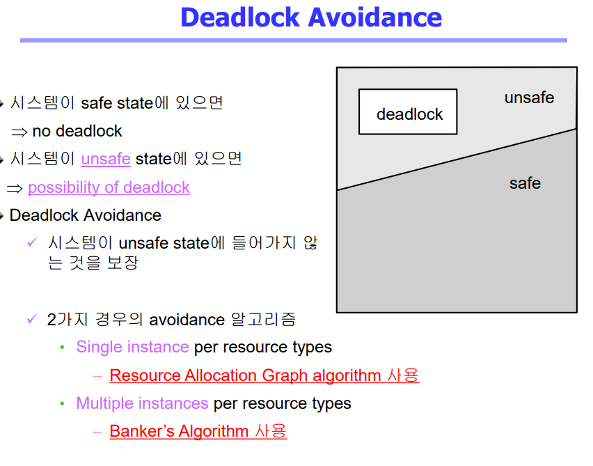
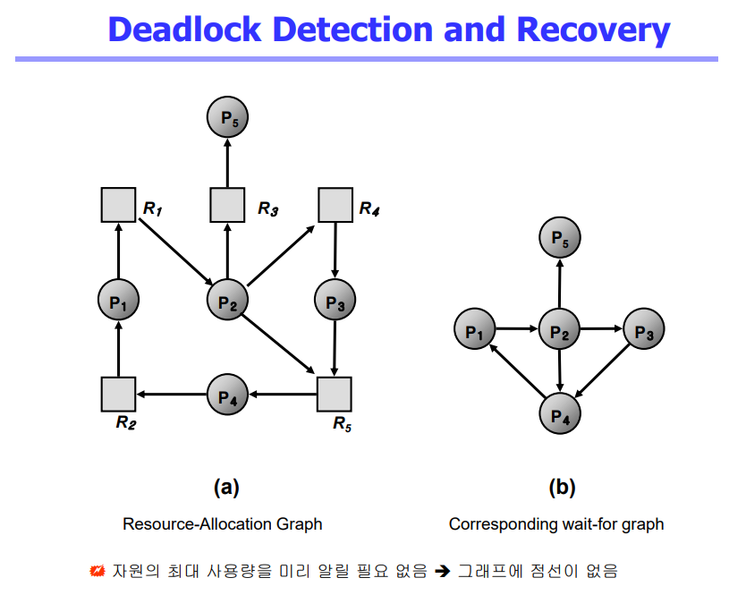

# Deadlock 2

## Deadlock Avoidance
- Deadlock avoidance
  - 자원 요청에 대한 부가정보를 이용해서 자원 할당이 deadlock으로부터 안전(safe)한지를 동적으로 조사해서 안전한 경우에만 할당
  - 가장 단순하고 일반적인 모델은 프로세스들이 필요로 하는 각 자원별 최대 사용량을 미리 선언하도록 하는 방법임
- safe state
  - 시스템 내의 프로세스들에 대한 safe sequence가 존재하는 상태
- safe sequence
  - 프로세스의 sequence<P1,P2,...,PN>이 safe하려면 Pi(1<=i<=n)의 자원 요청이 "가용 자원 + 모든 Pj(j<i)의 보유 자원"에 의해 충족되어야 함
  - 조건을 만족하면 다음 방법으로 모든 프로세스의 수행을 보장
    - Pi의 자원 요청이 즉시 충족될 수 없으면 모든 Pj(j<i)가 종료될 때까지 기다린다
    - Pi-1이 종료되면 Pi의 자원요청을 만족시켜 수행한다
  
  

## Deadlock Detection and Recovery
- Deadlock Detection
  - Resource type 당 single instance인 경우
    - 자원할당 그래프에서의 cycle이 곧 deadlock을 의미
  - Resource type 당 multiple instance인 경우
    - Banker's algorithm과 유사한 방법 활용
- Wait-for graph 알고리즘
  - Resource type 당 single instance인 경우
  - Wait-for graph
    - 자원할당 그래프의 변형
    - 프로세스만으로 node 구성
    - Pj가 가지고 있는 자원을 Pk가 기다리는 경우 Pk->Pj
  - Algorithm
    - Wait-for graph에 사이클이 존재하는지를 주기적으로 조사
    - O(n2)

- Recovery
  - Process termination
    - Abort all deadlocked processes
    - Abort one process at a time until the deadlock cycle is elimniated
  - Resource Preemption
    - 비용을 최소화할 victim의 선정
    - safe stae로 rollback하여 process를 restart
    - Starvation 문제
      - 동일한 프로세스가 계속해서 victim으로 선정되는 경우
      - cost factor에 rollback 횟수도 같이 고려

## Deadlock Ignorance
  - Deadlock이 일어나지 않는다고 생각하고 아무런 조치도 취하지 않음
    - Deadlock이 매우 드물게 발생하므로 deadlock에 대한 조치 자체가 더 큰 오버헤드일 수 있음
    - 만약, 시스템에 deadlock이 발생한 경우 시스템이 비정상적으로 작동하는 것을 사람이 느낀 후 직접 process를 죽이는 등의 방법으로 대처
    - UNIX, Windows 등 대부분의 범용 OS가 채택