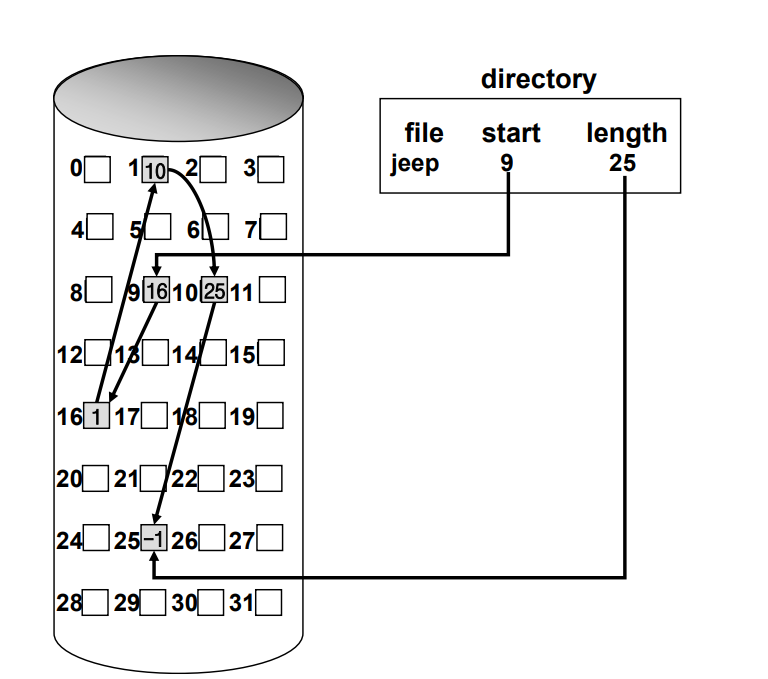
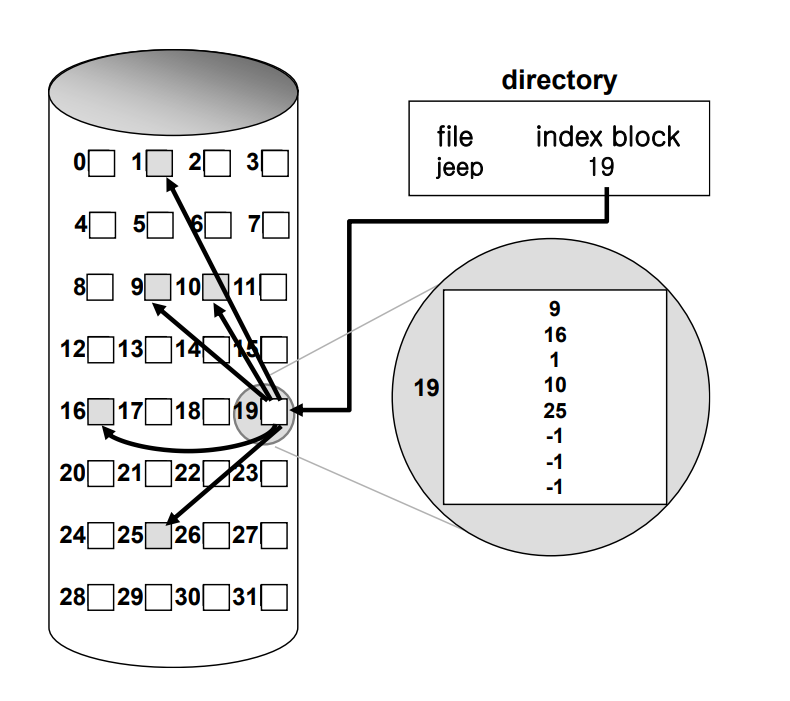
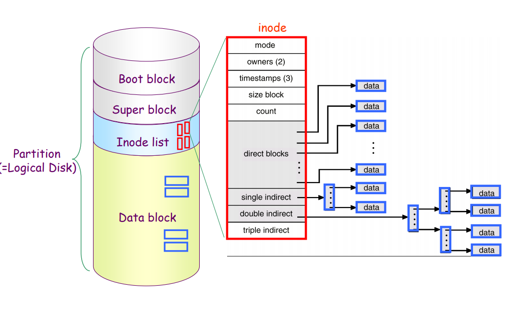
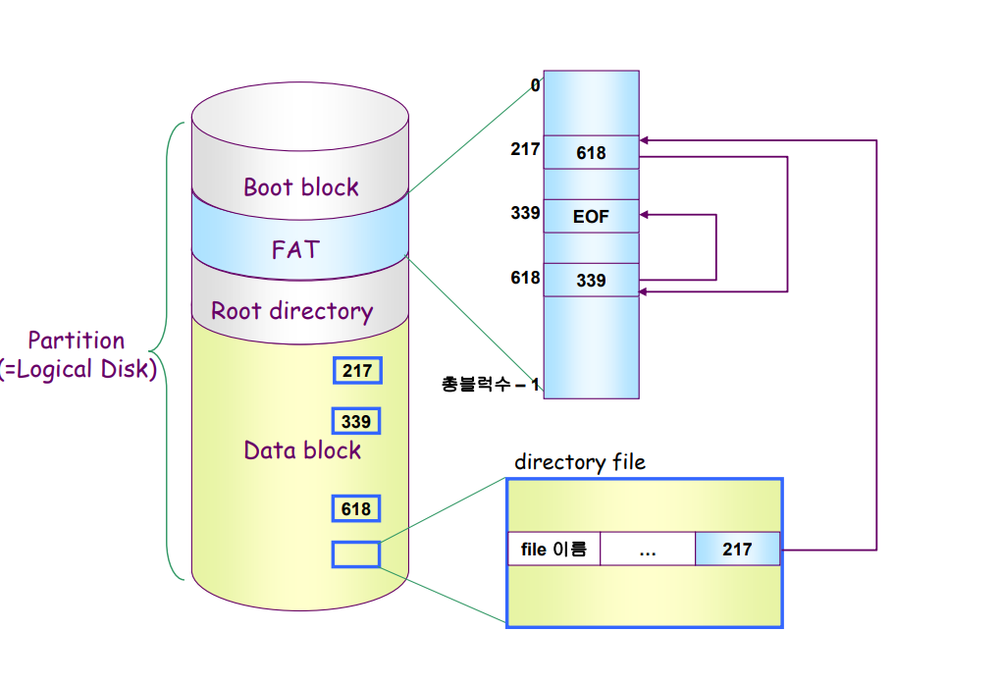
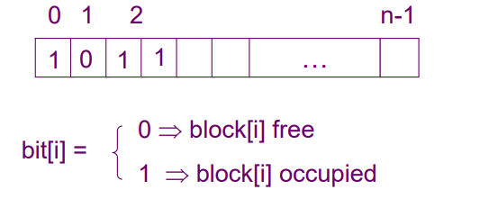
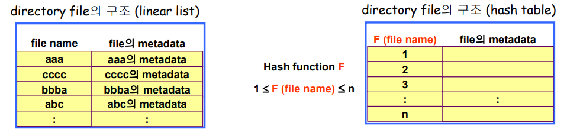

# Disk Management & Scheduling 1

## Disk Structure
- logical block
  - 디스크의 외부에서 보는 디스크의 단위 정보 저장 공간들
  - 주소를 가진 1차원 배열처럼 취급
  - 정보를 전송하는 최소 단위

- Sector
  - Logical block이 물리적인 디스크에 매핑된 위치
  - Sector 0은 최외곽 실린더의 첫 트랙에 있는 첫 번재 섹터이다

 

## Disk Management
- physical formatting(Low-level formatting)
  - 디스크르 컨트롤러가 읽고 쓸 수 있도록 섹터들로 나누는 과정
  - 각 섹터는 header + 실제 data(보통 512 bytes) + trailer로 구성
  - header와 trailer는 secotr number, ECC(Error-Correcting Code) 등의 정보가 저장되며 controller가 직접 접근 및 운영

- Partitioning
  - 디스크를 하나 이상의 실린더 그룹으로 나누는 과정
  - OS는 이것을 독립적 disk로 취급 (logical disk)

- Logical formaating
  - 파일시스템을 만드는 것
  - FAT, inode, free space 등의 구조 포함

- Booting
  - ROM에 있는 "small bootstrap loader"의 실행
  - sector 0 (boot block)을 load하여 실행
  - sector 0은 "full Bootstrap loader program"
  - OS를 디스크에서 load하여 실행

 

## Disk Scheduling
- Access time의 구성
  - Seek time
    - 헤드를 해당 실린더로 움직이는데 걸리는 시간
  - Rotational latency
    - 헤드가 원하는 섹터에 도달하기까지 걸리는 회전지연시간
  - Transfer time
    - 실제 데이터의 전송 시간
  
- Disk bandwidth
  - 단위 시간 당 전송된 바이트의 수

- Disk Scheduling
  - seek time을 최소화하는 것이 목표
  - seek time = seek distance 

 

## Disk Scheduling Algorithm
- 큐에 다음과 같은 실린더 위치의 요청이 존재하는 경우 디스크 헤드 53번에서 시작한 각 알고리즘의 수행 결과는? (실린더 위치는 0-199) 98, 183, 37, 122, 14, 124, 65, 67

- FCFS(First Come First Service)

 

- SSTF (Shortest Seek Time First)
  - starvation 문제
  - 총 head의 이동: 236 cylinders
  

 

- SCAN
  - disk arm이 디스크의 한쪽 끝에서 다른쪽 끝으로 이동하며 가는 길목에 있는 모든 요청을 처리한다
  - 다른 한쪽 끝에 도달하면 역방향으로 이동하며 오는 길목에 있는 모든 요청을 처리하며 다시 반대쪽 끝으로 이동한다
  - 문제점: 실린더 위치에 따라 대기 시간이 다르다
  

 

- C-SCAN
  - 헤드가 한쪽 끝에서 다른쪽 끝으로 이동하며 가는 길목에 있는 모든 요청을 처리
  - 다른쪽 끝에 도달했으면 요청을 처리하지 않고 곧바로 출발점으로 다시 이동
  - SCAN보다 균일한 대기 시간을 제공한다
  

 

- Other Algorithms
  - N-SCAN
    - SCAN의 변형 알고리즘
    - 일단 arm이 한 방향으로 움직이기 시작하면 그 시점 이후에 도착한 job은 되돌아올 때 service
  
  - LOOK and C-LOOK
    - SCAN이나 C-SCAN은 헤드가 디스크 끝에서 끝으로 이동
    - LOOK과 C-LOOK은 헤드가 진행 중이다가 그 방향에 더 이상 기다리는 요청이 없으면 헤드의 이동방향을 즉시 반대로 이동 한다

    

 

## Disk-Scheduling Algorithm의 결정
  - SCAN, C-SCAN 및 그 응용 알고리즘은 LOOK, C-LOOK 등이 일반적으로 디스크 입출력이 많은 시스템에서 효율적인 것으로 알려져 있음
  - File의 할당 방법에 따라 디스크 요청이 영향을 받음
  - 디스크 스케줄링 알고리즘은 필요할 경우 다른 알고리즘으로 쉽게 교체할 수 있도록 OS와 별도의 모듈로 작성되는 것이 바람직하다