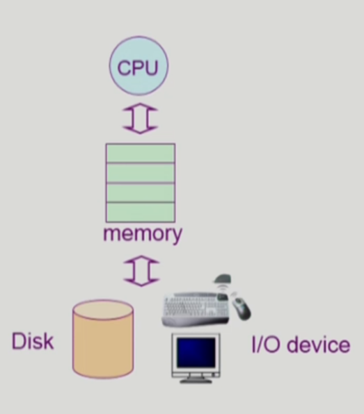

# Introduction to Operating Systems

## 운영체제란?
- 컴퓨터 하드웨어 바로 위에 설치되어 사용자 및 다른 모든 소프트웨어와 하드웨어를 연결하는 소프트웨어 계층
- 좁은 의미(커널)
  - 운영체제의 핵심 부분으로 메모리에 상주하는 부분
- 넓은 의미
  - 커널 뿐 아니라 각종 주변 시스템 유틸리티를 포함한 개념
  - 메모리에 상주하지 않는 별도의 프로그램

 

## 운영체제의 목적
- **컴퓨터 시스템의 자원을 효율적으로 관리**
  - cpu,기억장치, 입출력 장치 등의 효율적 관리
- 컴퓨터 시스템을 편리하게 사용할 수 있는 환경을 제공

 

## 운영체제의 분류
### 동시 작업 가능 여부
- 단일 작업
  - 한 번에 하나의 작업만 처리
- 다중 작업
  - 동시에 두 개 이상의 작업 처리

### 사용자의 수
- 단일 사용자
- 다중 사용자

### 처리 방식
- 일괄 처리
- 시분할
  - 여러 작업을 수행할 때 컴퓨터 처리 능력을 일정한 시간 단위로 분할하여 사용
  - 일괄 처리 시스템에 비해 짧은 응답 시간을 가짐
  - 사람이 느끼기에 빠르게 느껴지게하고 주어진 자원을 최대한 활용하기 위함
- 실시간
  - 정해진 시간 안에 어떠한 일이 반드시 종료됨이 보장되어야하는 실시간 시스템을 위한 OS
  - 개념 확장
    - Hard realtime system(경성 실시간 시스템)
    - Soft realtime system(연성 실시간 시스템)

 

## 용어
- Multitasking
- Multiprogramming
- Time sharing
- Multiprocess
- 구분
  - 위의 용어들은 컴퓨터에서 여러 작업을 동시에 수행하는 것을 뜻함
  - Multiprograaming은 여러 프로그램이 메모리에 올라가 있음을 강조
  - Time sHARING은 CPU의 시간을 분할하여 나누어 쓴다

  - Multiprocessor: 하나의 컴퓨터에 CPU(processor)가 여러 개 붙어 있음을 의미

 

## 운영체제의 예
- 유닉스(UNIX)
- DOS
- MS WINDOWS

 

## 운영 체제의 구조
- CPU 스케줄링: 누구한테 CPU를 줄까
- 메모리 관리: 한정된 메모리를 어떻게 쪼개어 쓰지?
- 파일 관리: 디스크에 파일을 어떻게 보관하지?
- 입출력 관리: 각기 다른 입출력장치와 컴퓨터 간에 어떻게 정보를 주고 받게 하지?

## 질문
1. 운영체제의 넓은 의미와 좁은 의미를 설명
2. 운영체제의 목적은?
3. 운영체제의 분류는?
  3-1. 시분할과 실시간의 차이점은?