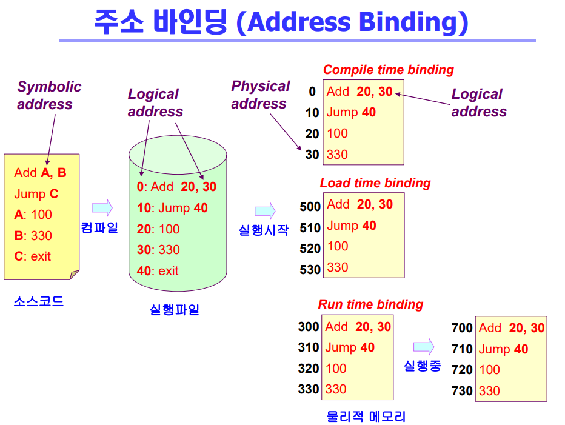
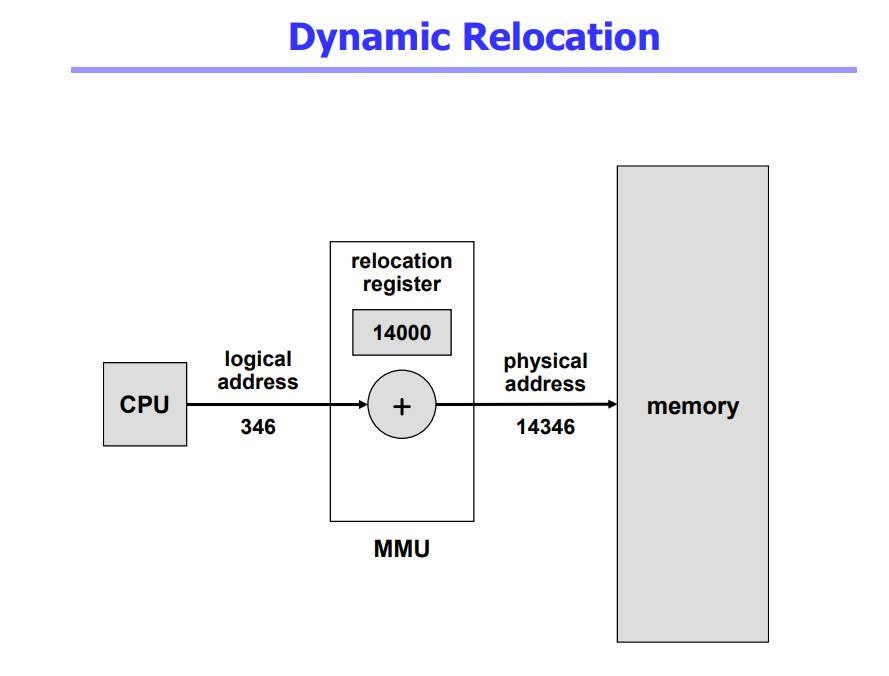
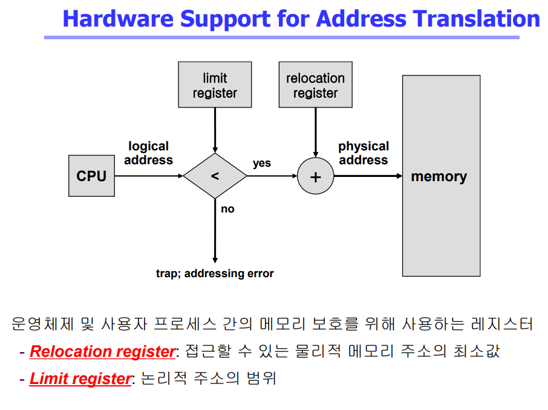
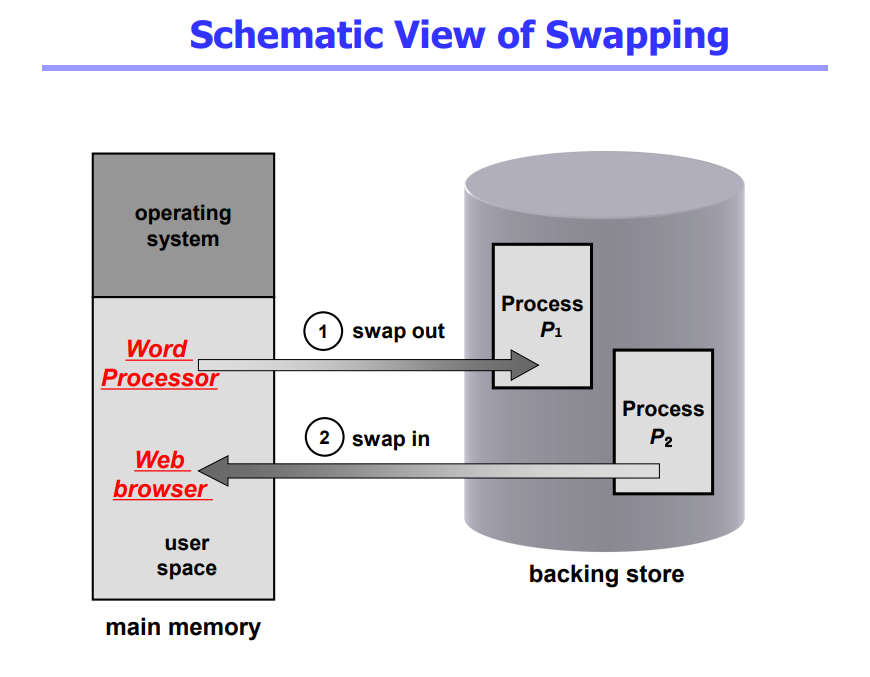
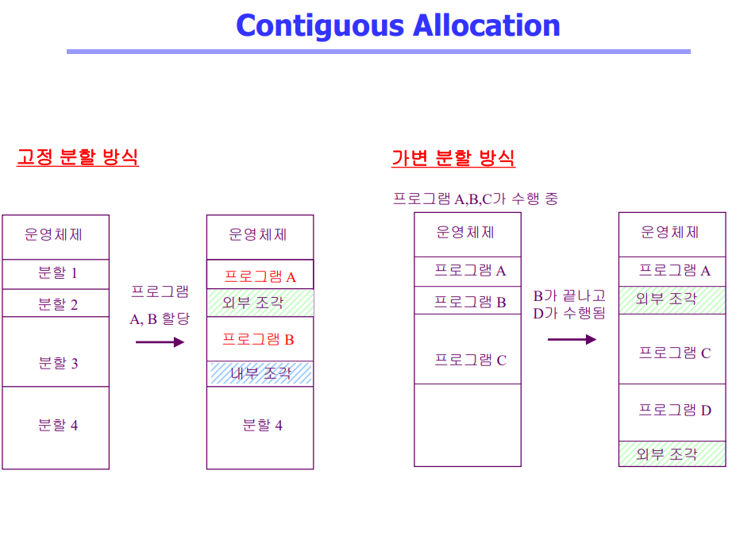

# Memory Management 1

## Logical vs. Physical Address
- Logical address(=virtual address)
  - 프로세스마다 독립적으로 가지는 주소 공간
  - 각 프로세스마다 0번지부터 시작
  - CPU가 보는 주소는 logical address임

- Physical address
  - 메모리에 실제 올라가는 위치

* 주소 바인딩: 주소를 결정하는 것
- Symolic Address -> Logical Address -> Physical address

## 주소 바인딩(Address Binding)
- Compile time binding
  - 물리적 메모리 주소(physical address)가 컴파일 시 알려짐
  - 시작 위치 변경시 재컴파일
  - 컴파일러는 절대 코드(absolute code) 생성

- Load time binding
  - Loader의 책임하에 물리적 메모리 주소 부여
  - 컴파일러가 재배치가능코트(relocatable code)를 생성한 경우 가능

- Execution time binding(=Run time binding)
  - 수행이 시작된 이후에도 프로세스의 메모리 상 위치를 옮길 수 있음
  - CPU 가 주소를 참조할 때마다 binding을 점검(address mapping table)
  - 하드웨어적인 지원이 필요

 

## Memory-Management Unit(MMU)
- MMU(Memory-Management Unit)
  - logical address를 phyusical address로 매핑해 주는 Hardware device

- MMU scheme
  - 사용자 프로세스가 CPU에서 수행되며 생성해내는 모든 주소값에 대해 base register(=relocation register)의 값을 더한다

- user program
  - logical address만을 다룬다
  - 실제 physical address를 볼 수 없으며 알 필요가 없다

 

## Dynamicl Loading
- 프로세스 전체를 메모리에 미리 다 올리는 것이 아니라 해당 루틴이 불려질 때 메모리에 load하는 것
- memory utilization의 향상
- 가끔씩 사용되는 많은 양의 코드의 경우 유용
  - ex: 오류 처리 루틴
- 운영체제의 특별한 지원이 없이 프로그램 자체에서 구현 가능(OS는 라이브러리를 통해 지원 가능)
- Loading: 메모리로 올리는 것

 

## Overlays
- 메모리에 프로세스의 부분 중 실제 필요한 정보만을 올림
- 프로세스의 크기가 메모리보다 클 때 유용
- 운영체제의 지원없이 사용자에 의해 구현
- 작은 공간의 메모리를 사용하던 초창기 시스템에서 수작업으로 프로그래머가 구현
  - "Manual Overlay"
  - 프로그래밍이 매우 복잡

 

## Swapping
- Swapping
  - 프로세스를 일시적으로 메모리에서 backing store로 쫓아내는 것
- Backing store(=swap area)
  - 디스크
    - 많은 사용자의 프로세스 이미지를 담을 만큼 충분히 빠르고 큰 저장 공간
- Swap in / Swap out
  - 일반적으로 중기 스케줄러(swapper)에 의해 swap out 시킬 프로세스 선정
  - priority-based CPU scheduling algorithm
    - priority가 낮은 프로세스를 swapped out 시킴
    - priority가 높은 프로세스를 메모리에 올려 놓음
  - Compile time 혹은 load time binding에서는 원래 메모리 우치로 swap in 해야 함
  - Execution time binding에서는 추후 빈 메모리 영역 아무 곳에나 올릴 수 있음
  - Swap time은 대부분 transfer time (swap되는 양에 비례하는 시간)임

 

## Dynamic Linking
- Linking을 실행 시간(execution time)까지 미루는 기법
- Static linking
  - 라이브러리가 프로그램의 실행 파일 코드에 포함됨
  - 실행 파일의 크기가 커짐
  - 동일한 라이브러리를 각각의 프로세스가 메모리에 올리므로 메모리 낭비(eg. printf 함수의 라이브러리 코드)
- Dynamic linking
  - 라이브러리가 실행시 연결(link)됨
  - 라이브러리 호출 부분에 라이브러리 루틴의 위치를 찾기 위한 stub이라는 작은 코드를 둠
  - 라이브러리가 이미 메모리에 있으면 그 루틴의 주소로 가고 없으면 디스크에서 읽어옴
  - 운영체제의 도움이 필요
- DLL

## Allocation of Physical Memory
- 메모리는 일반적으로 두 영역으로 나뉘어 사용
  - OS 상주 영역
    - interrupt vector와 함께 낮은 주소 영역 사용
  - 사용자 프로세스 영역
    - 높은 주소 영역 사용

- 사용자 프로세스 영역의 할당 방법
  - Contiguous allocation(연속 할당)
    : 각각의 프로세스가 메모리의 연속적인 공간에 적재되도록 하는 것
    - Fixed partition allocation
    - Variable partition allocation
  - Noncotiguous allocation
    : 하나의 프로세스가 메모리의 여러 영역에 분산되어 올라갈 수 있음
    - Paging
    - Segmentation
    - Paged Segmentation

## Contiguous allocation(연속 할당)
- Contiguous allocation(연속 할당)
  - 고정분할(Fixed partition)방식
    - 물리적 메모리를 몇 개의 영구적 분할(partition)로 나눔
    - 분할의 크기가 모두 동일한 방식과 서로 다른 방식이 존재
    - 분할당 하나의 프로그램 적재
    - 융통성이 없음
      - 동시에 메모리에 load되는 프로그램의 수가 고정됨
      - 최대 수행 가능 프로그램 크기 제한
    - Internal fragmentation 발생(external frgmentation도 발생)

- 가변분할(Variable partition) 방식
  - 프로그램의 크기를 고려해서 할당
  - 분할의 크기, 개수가 동적으로 변함
  - 기술적 관리 기법 필요
  - External Fragmentation 발생

- External fragmentation (외부 조각)
  - 프로그램 크기보다 분할의 크기가 작은 경우
  - 아무 프로그램에도 배정되지 않은 빈 곳인데도 프로그램이 올라갈 수 없는 작은 분할

- Internal fragmentation (내부 조각)
  - 프로그램 크기보다 분할의 크기가 큰 경우
  - 하나의 분할 내부에서 발생하는 사용되지 않는 메모리 조각
  - 특정 프로그램에 배정되었지만 사용되지 않는 공간

- Hole
  - 가용 메모리 공간
  - 다양한 크기의 hole들이 메모리 여러 곳에 흩어져 있음
  - 프로세스가 도착하면 수용가능한 hole을 할당
  - 운영체제는 다음의 정보를 유지
    a) 할당 공간 b) 가용 공간 (hole)

- Dynamic Storage-Allocation Problem: 가변 분할 방식에서 size n인 요청을 만족하는 가장 적절한 hole을 찾는 문제
  - First-fit
    - Size가 n 이상인 것 중 최초로 찾아지는 hole에 할당
  - Best-fit
    - Size가 n 이상인 가장 작은 hole을 찾아서 할당
    - Hole들의 리스트가 크기순으로 정렬되지 않은 경우 모든 hole의 리스트를 탐색해야함
    - 많은 수의 아주 작은 hole들이 생성됨
  - Worst-fit
    - 가장 큰 hole에 할당
    - 역시 모든 리스트를 탐색해야 함
    - 상대적으로 아주 큰 hole들이 생성됨
  - First-fit과 best-fit이 worst-fit보다 속도와 공간 이용률 측면에서 효과적인 것으로 알려짐 (실험적인 결과)

- compaction
  - external fragmentation 문제를 해결하는 한 가지 방법
  - 사용 중인 메모리 영역을 한군데로 몰고 hole들을 다른 한 곳으로 몰아 큰 block을 만드는 것
  - 매우 비용이 많이 드는 방법임
  - 최소한의 메모리 이동으로 compaction하는 방법 (매우 복잡한 문제)
  - Compaction은 프로세스의 주소가 실행 시간에 동적으로 재배치 가능한 경우에만 수행될 수 있다

## 질문
1. "Swapping 기법에서 Compile time binding 방식과 Execution(Run) time binding 방식의 차이점을 Swap-in 관점에서 설명해 보세요."
 - "Compile time binding 환경에서는 이미 컴파일 시점에 물리 주소가 고정되어 버리기 때문에, 프로세스가 Swap-out 되었다가 다시 Swap-in 될 때 반드시 이전에 있던 그 물리 메모리 위치로만 돌아가야 합니다. 만약 그 자리에 다른 프로세스가 있다면 대기해야 하므로 메모리 활용도가 극히 떨어집니다. 반면, Execution time binding 환경에서는 실행 시점에 MMU를 통해 주소가 동적으로 매핑되므로, Swap-in 될 때 원래 위치가 아닌 현재 비어있는 임의의 메모리 영역 공간 어디든 올라갈 수 있어 현대 운영체제에서 훨씬 효율적으로 사용됩니다.

2. 가변분할 방식에서 발생하는 '외부 단편화(External Fragmentation)' 문제를 해결하기 위한 방법으로 Compaction(압축)이 있습니다. 이 압축 기법의 치명적인 단점은 무엇이며, 현대 OS는 이 단편화 문제를 근본적으로 어떻게 해결하고 있습니까?"
 - "Compaction은 사방에 흩어진 빈 공간을 만들기 위해 현재 수행 중인 프로세스들의 메모리 위치를 통째로 이동시켜야 합니다. 이 과정에서 수많은 메모리 복사 작업과 주소 재배치가 일어나므로 시스템 오버헤드가 극도로 크고, 프로세스가 일시 중지되는 등 비용이 매우 많이 든다는 치명적인 단점이 있습니다. 따라서 현대 운영체제는 연속 할당의 단점을 극복하기 위해, 하나의 프로세스를 일정한 크기로 쪼개어 메모리의 여러 군데에 분산하여 적재하는 페이징(Paging) 기법과 같은 불연속 할당(Non-contiguous allocation) 방식을 사용하여 외부 단편화 문제를 근본적으로 해결하고 있습니다."
 