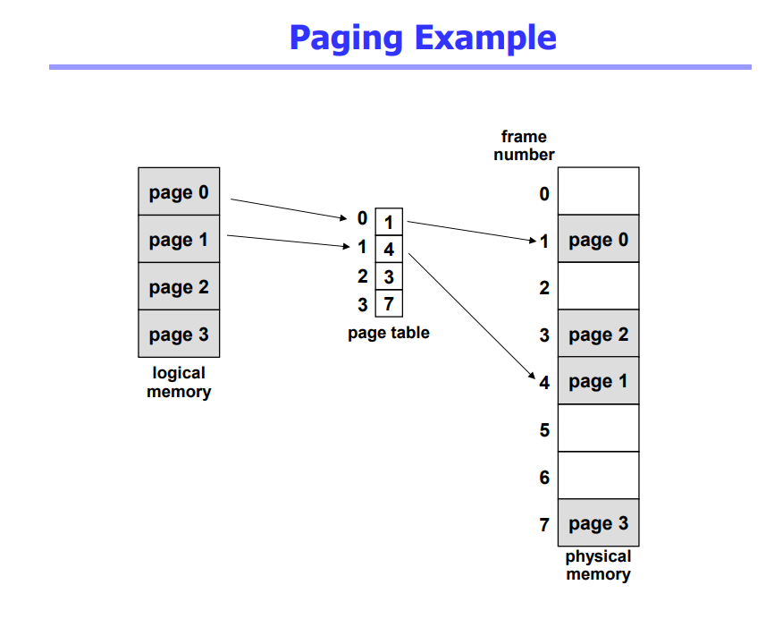
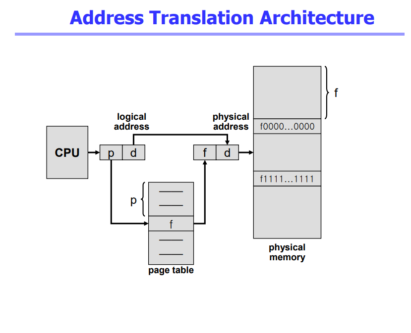
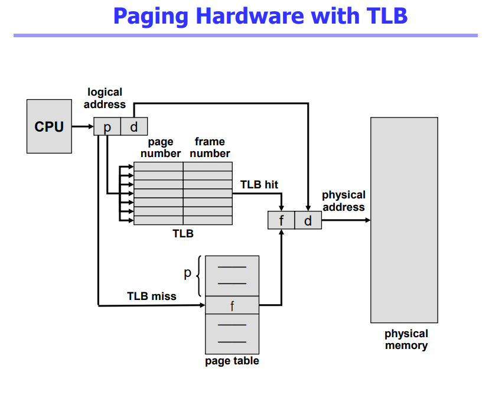
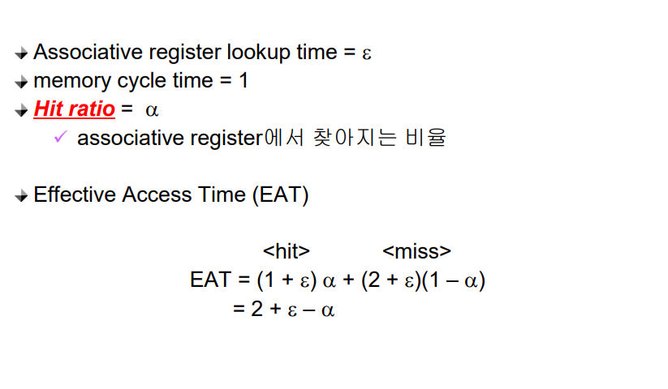
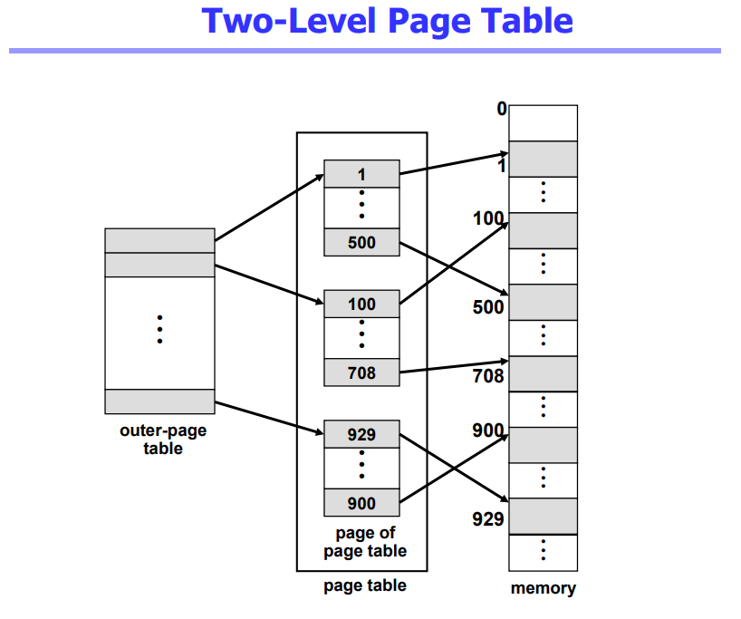

# Memory Management 2

## Paging
- Paging
  - Process의 virtual memory를 동일한 사이즈의 page 단위로 나눔
  - Virtual memory의 내용이 page 단위로 noncontiguous하게 저장됨
  - 일부는 backing storage에, 일부는 physical memory에 저장 
- Basic Method
  - physical memory를 동일한 크기의 frame으로 나눔
  - logical memory를 동일 크기의 page로 나눔 (frame과 같은 크기)
  - 모든 가용 frame들을 관리
  - page table을 사용하여 logical address를 physical address로 변환
  - External fragmentation 발생 안함
  - Internal fragmentation 발생 가능

 

## Implementation of Page Table
- Page table은 main memory에 상주
- Page-table base register (PTBR)가 page table을 가리킴
- Page-table length register (PTLR)가 테이블 크기를 보관
- 모든 메모리 접근 연산에는 2번의 memory access 필요
- page table 접근 1번, 실제 data/instruction 접근 1번
- 속도 향상을 위해
  - associative register 혹은 translation look-aside buffer (TLB)라 불리는 고속의 lookup hardware cache 사용

## Associative Register
- Associative registers (TLB): parallel search가 가능
  -  TLB에는 page table 중 일부만 존재
- Address translation
  -  page table 중 일부가 associative register에 보관되어 있음
  -  만약 해당 page #가 associative register에 있는 경우 곧바로 frame #를 얻음
  -  그렇지 않은 경우 main memory에 있는 page table로부터 frame #를 얻음
  -  TLB는 context switch 때 flush (remove old entries)

## Effective Access Time

## Two-Level Page Table
- 현대의 컴퓨터는 address space가 매우 큰 프로그램 지원
-  32 bit address 사용시: 232 (4G)의 주소 공간
  - page size가 4K시 1M개의 page table entry 필요
  - 각 page entry가 4B시 프로세스당 4M의 page table 필요
  - 그러나, 대부분의 프로그램은 4G의 주소 공간 중 지극히 일부분만 사용하므로 page table 공간이 심하게 낭비됨
-  page table 자체를 page로 구성
-  사용되지 않는 주소 공간에 대한 outer page table의 엔트리 값은 NULL (대응하는 inner page table이 없음)

