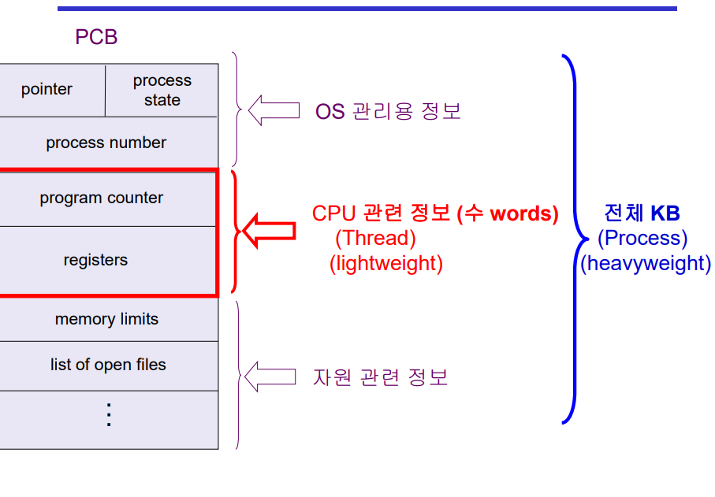

# Process2

## Thread(lightweight process)
- 프로세스 내부의 수행 단위
- 같은 일을 하는 프로세스 -> 메모리 공간에 하나만 띄어놓고 다른 부분의 코드를 실행, 프로그램 카운터만 여러 개 둔다
- 메모리 주소 공간 공유, 프로세스 상태, 각종 자원 공유, CPU 수행 관련한 것들은 별도로
- Thread의 구성
  - program counter
  - register set
  - stack space
- Thread끼리 공유(=Task)
  - code section
  - data section
  - OS resources
- 다중 스레드로 구성된 태스크 구조에서는 하나의 서버 스레드가 blocked(waiting) 상태인 동안에도 동일한 태스크 내의 다른 스레드가 실행(running)되어 빠른 처리를 할 수 있다.
- 동일한 일을 수행하는 다중 스레드가 협력하여 높은 처리율(throughput)과 성능 향상을 얻을 수 있다.
- 스레드를 사용하면 병렬성을 높일 수 있다.

 

## Benefits of Threads
- 응답성(Responsiveness)  
  - 웹 브라우저에서 사진을 다운받는 동안 글, 문서 등을 먼저 보여줌으로서 응답성이 좋게 보이게 할 수 있음
- 자원 공유(Resource Sharing)
  - 별도의 프로세스로 사용하는 것 보다는 하나의 프로세스를 만들고 그 안에 스레드를 두면 코드 데이터, 각종 자원 공유 가능
- 경제성(Economy)
  - 프로세스를 하나 만드는 것은 오버헤드가 큼
  - 프로세스 안에 스레드를 만드는 것이 오버헤드가 더 적음
  - 문맥 교환은 오버헤드가 큼
- 멀티 프로세서(Utilization of MP Architectrues)
  - 서로 다른 CPU에서 병렬적으로 일을 할 수 있음

 

## Implementation of Threads
- 커널 스레드
  - 스레드가 여러 개 있다는 사실을 운영체제가 알고 있음
- 유저 스레드
  - 라이브러리를 통해 지원
  - 스레드가 여러 개 있다는 사실을 운영체제가 모름
  - 유저 프로그램이 스스로 관리

## 질문
1. 스레드란?
2. 스레드의 장점을 말해보시오