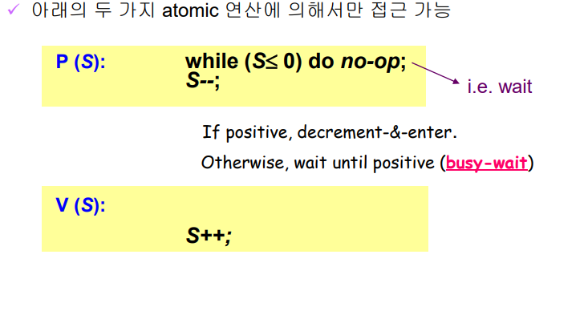
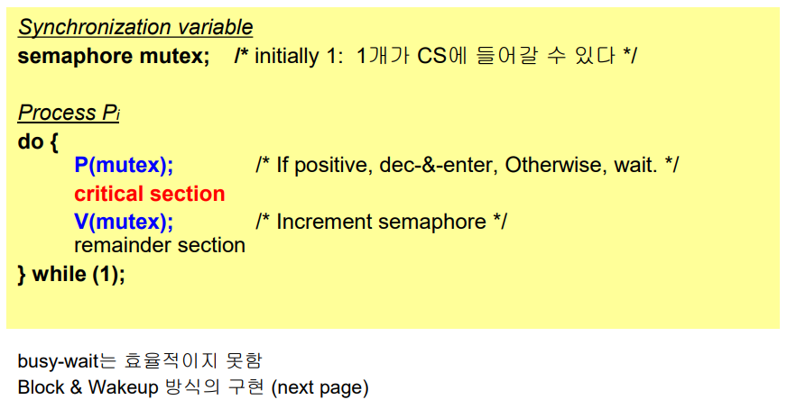
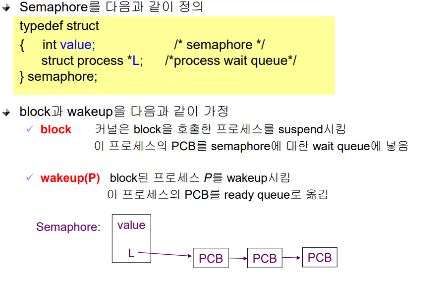
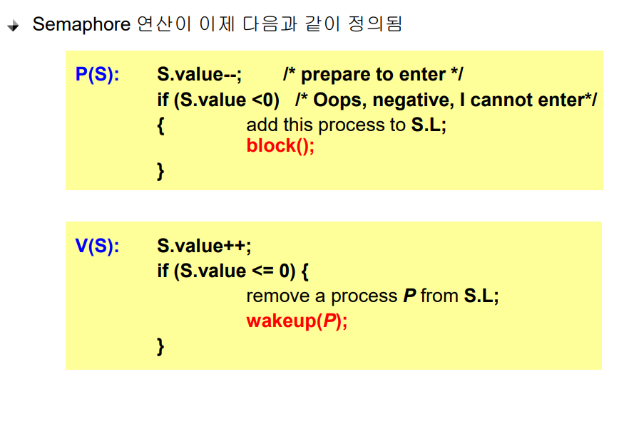

# Process Synchronization 2

## Semaphores(추상적인 자료)
- 앞의 방식들을 추상화시킴
- Semaphores S
  - integer variable
  - 아래의 두가지 atomic 연산에 의해서만 접근 가능
  
  - P연산 획득하는 연산
  - V연산 내어주는 연산

 

## Critical Section of n Processes

 

## Block / Wakeup Implementation

 

## Two Types of Semaphores
- Counting semaphore
  - 도메인이 0  이상인 임의의 정수값
  - 주로 resource counting에 사용
- Binary semaphore
  - 0 또는 1 값만 가질 수 있는 semaphore
  - 주로 mutual exclusion(lock/unlock)에 사용

 

## Deadlock and Starvation
- Deadlock
  - 둘 이상의 프로세스가 서로 상대방에 의해 충족될 수 있는 event를 무한히 기다리는 현상
  - 4가지 필수 조건
    1. 상호 배제
    2. 점유와 대기
    3. 비선점
    4. 순환 대기

- Starvation
  - indefinite blocking 프로세스가 suspend된 이유에 해당하는 세마포어 큐에서 빠져나갈 수 없는 현상
  - 특정 프로세스가 자원을 할당받지 못하고, 다른 우선순위 높은 프로세스들에게 계속 밀리는 현상

 

## 질문
1. 임계 구역의 조건 3가지
2. 세마포어의 종류 두가지를 자세히 설명해보시오
