# Process Synchronization 1

## 데이터의 접근
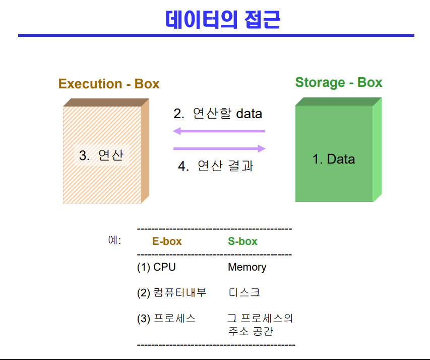

 

## Race Condition
- 멀티프로세서 CPU라면 메모리를 공유한다면 하나의 CPU가 A라는 데이터를 읽고 다른 CPU가 A라는 데이터를 읽는다면 문제가 생길 수 있음
- 공유 메모리
- 운영체제 커널
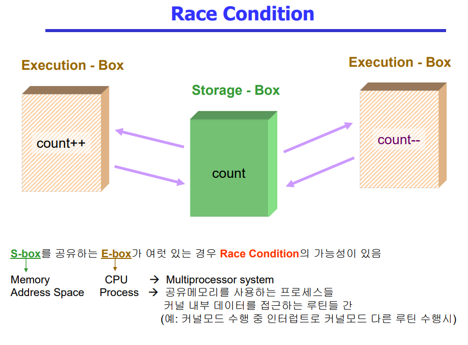

 

## OS에서의 race condition(1/3)
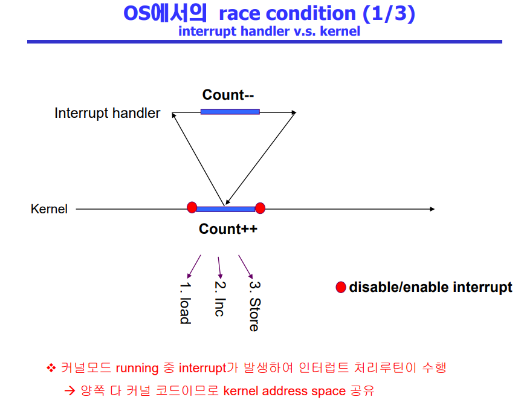
- 1 증가 한 것만 저장이됨
- kernel 코드 중에 건들렸기 때문
- 인터럽트 처리를 작업이 끝난 다음에 하는 걸로

 

## OS에서의 race condition(2/3)
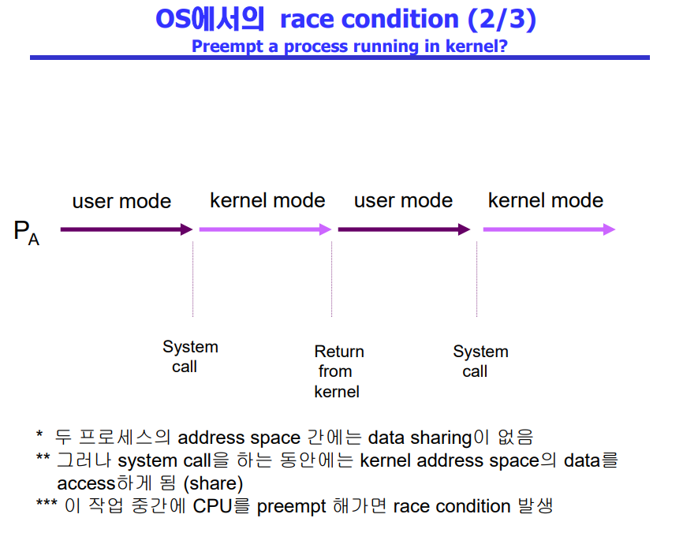
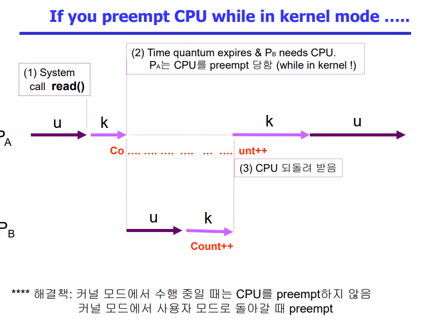

 

## OS에서의 race condition(3/3)
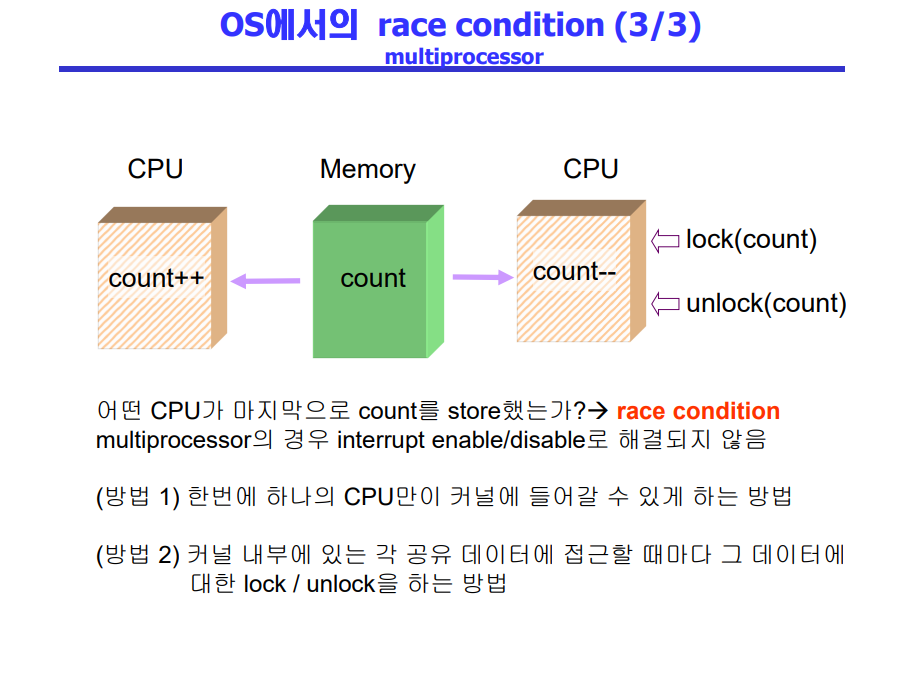

 

## Process Synchroniztion 문제
- 공유 데이터의 동시 접근은 데이터의 불일치 문제를 발생시킬 수 있다
- 일관성 유지를 위해서는 협력 프로세스 간의 실행 순서를 정해주는 메커니즘 필요
- Race condition
  - 여러 프로세스들이 동시에 공유 데이터를 접근하는 상황
  - 데이터의 최종 연산 결과는 마지막에 그 데이터를 다룬 프로세스에 따라 달라짐
- race condition을 막기 위해서는 concurrent process는 동기화되어야 한다

 

## The Critical-Section Problem(임계구역)
- n 개의 프로세스가 공유 데이터를 동시에 사용하기를 원하는 경우
- 각 프로세스의 code segment에는 공유 데이터를 접근하는 코드인 critical section이 존재
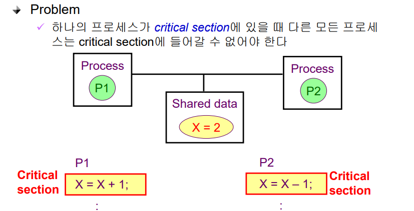

 

## 프로그램적 해결법의 충족 조건
- Mutual Excluston(상호 배제)
  - 프로세스 Pi가 critical section 부분을 수행 중이면 다른 모든 프로세스들은 그들의 critical section에 들어가면 안 된다
- Progress(진행)
  - 아무도 critical section에 있지 않은 상태에서 critical section에 들어가고자 하는 프로세스가 있으면 critical section에 들어가게 해주어야 한다
- Bounded Waiting(유한 대기)
  - 프로세스가 critical section에 들어가려고 요청한 후부터 그 요청이 허용될 때가지 다른 프로세스들이 critcial section에 들어가는 횟수에 한계가 있어야 한다

 

## Initial Attempts to Solve Problem
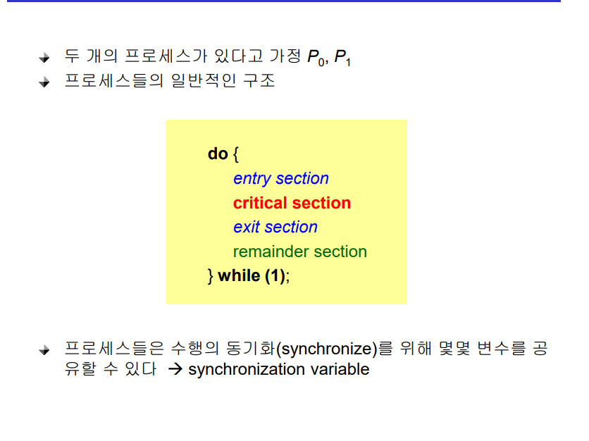

 

## Algorithm 1
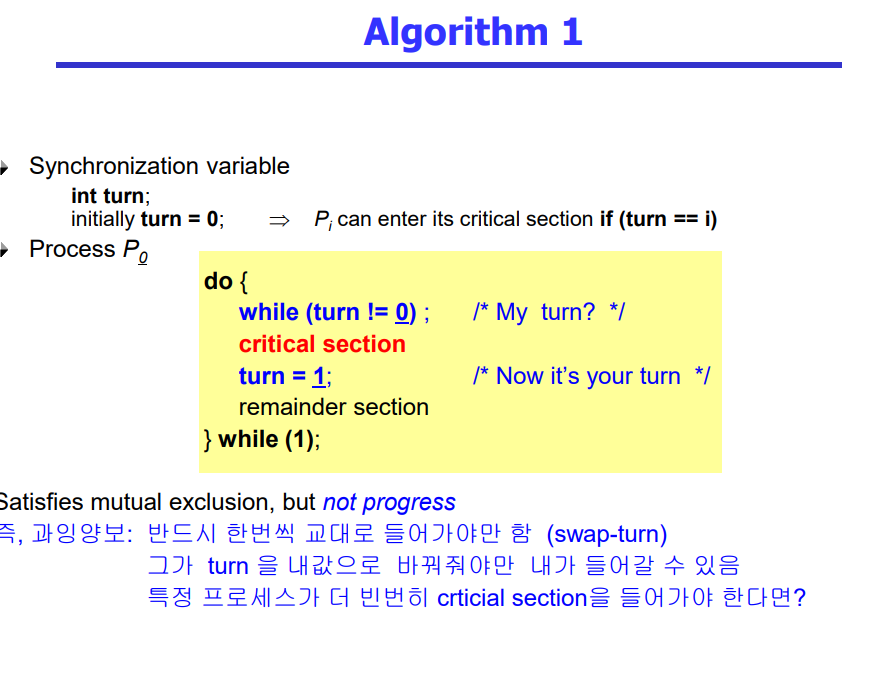
- progress 조건 충족 못함

 

## Algorithm 2 
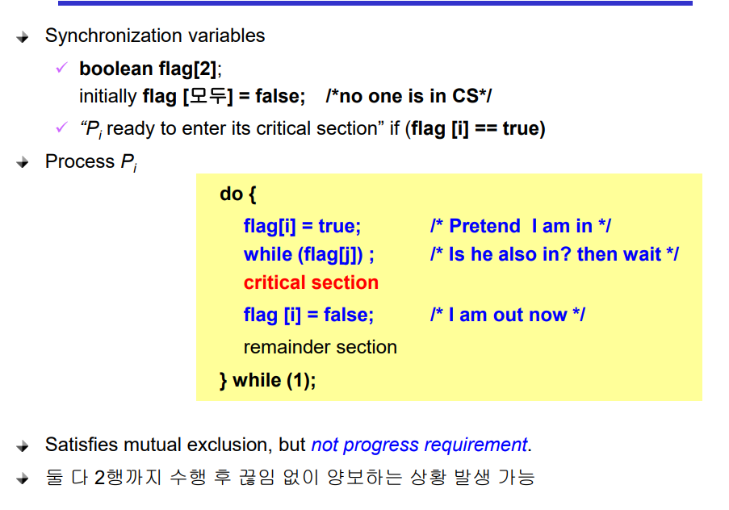
- progress 조건 충족 못함

 

## Algorithm 3(Peterson's Algorithm)
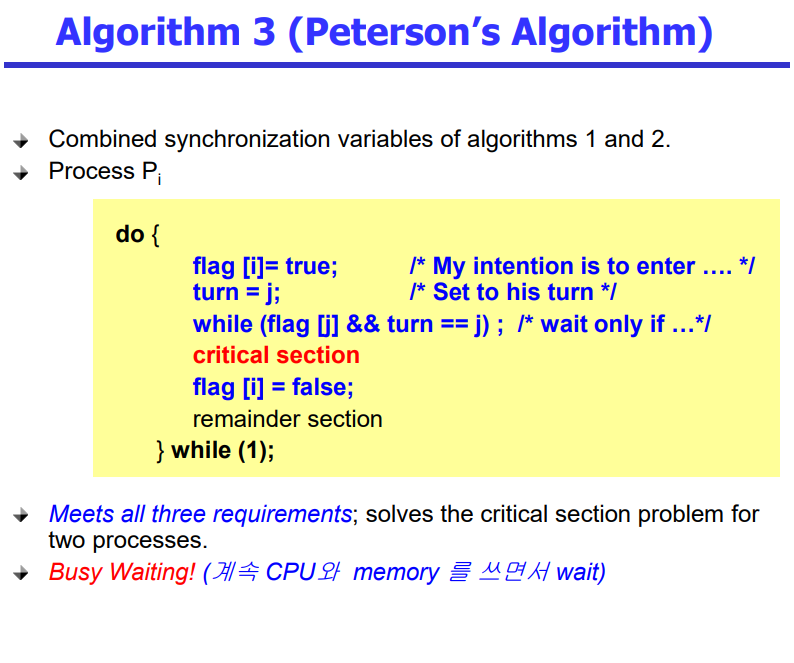
- spin lock문제

 

## Synchronization Hardware
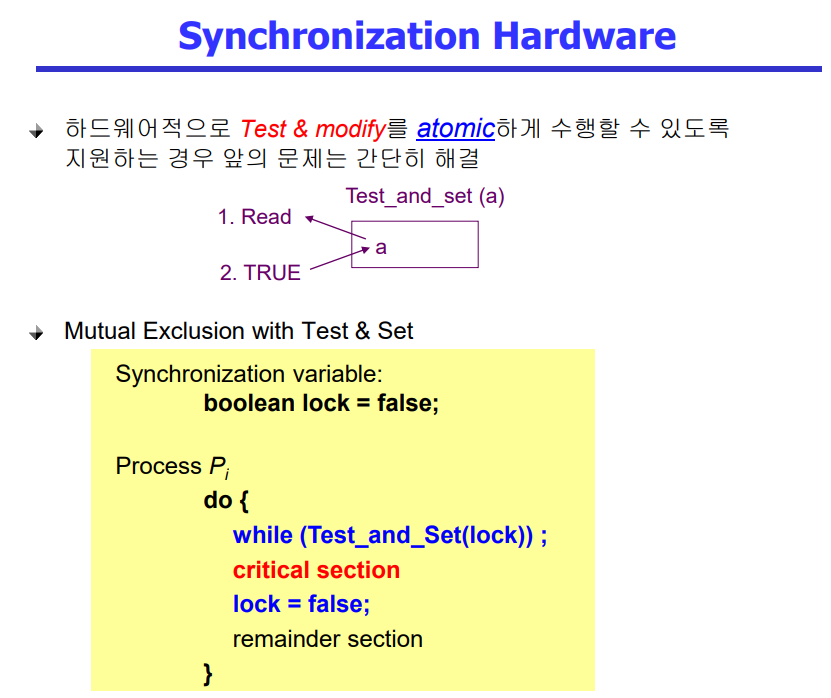

## 질문
1. 커널 관점에서 Race Condition 문제를 말해보시오