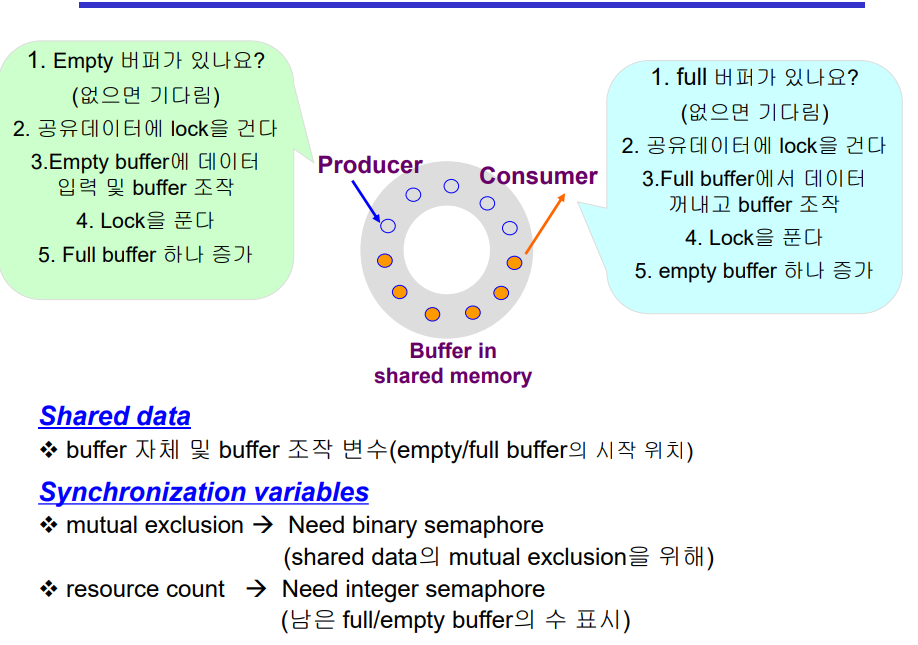
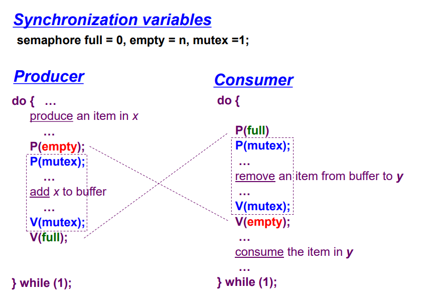
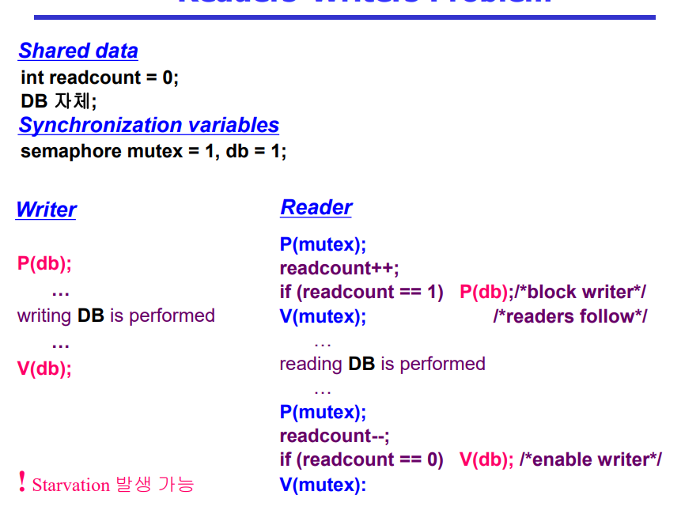
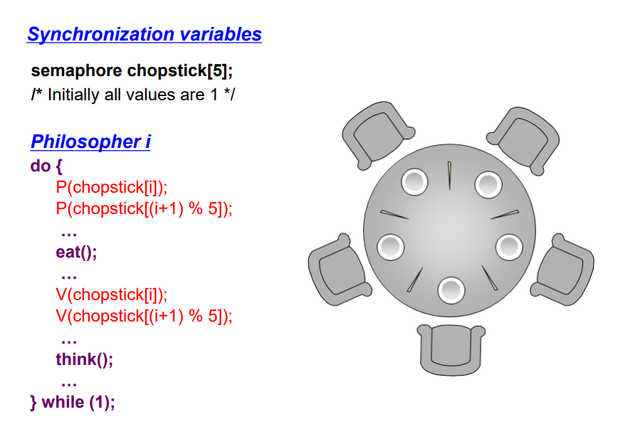
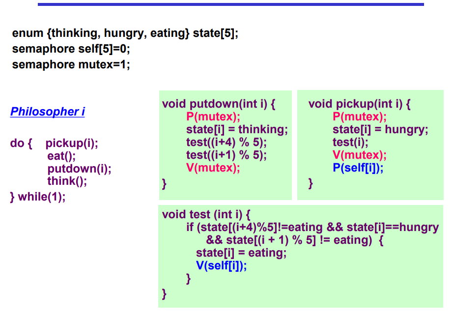
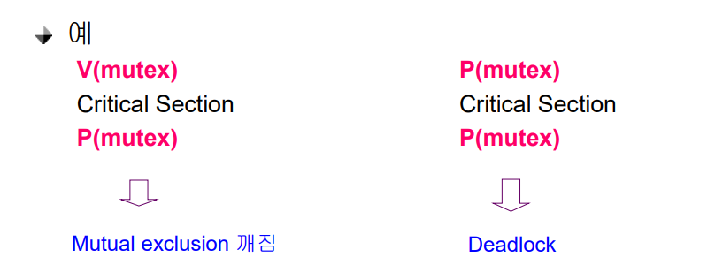
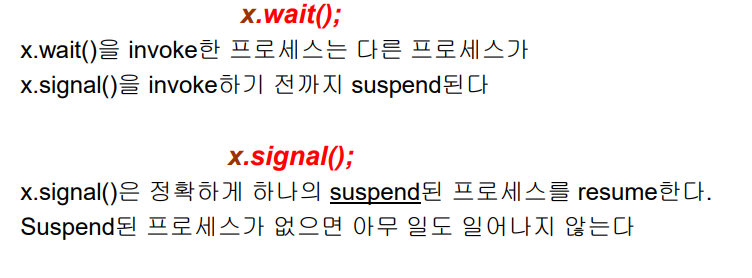

# Process Synchronization 3

## Bounded-Buffer Problem(생산자 소비자 문제)
- Producer
  - 데이터를 만들어서 집어넣는 역할
- Consumer

1. 동시에 도착했을 경우 -> 뮤텍스로 해결(락을 걸고 풀고)
2. 생산자가 많이 도착했을 경우, 소비자가 많을 경우 -> 카운팅 

 

## Readers-Writers Problem
- 한 프로세스가 DB에 쓰는 중일 때 다른 프로세스가 접근하면 안됨
- 읽는 것은 동시에 여럿이 해도 됨
- solution
  - Writer가 DB에 접근 허가를 아직 얻지 못한 상태에서는 모든 대기중인 Reader들을 다 DB에 접근하게 해준다
  - Writer는 대기 중인 Reader가 하나도 없을 때 DB 접근이 허용된다
  - 일단 Writer가 DB에 접근 중이면 Reader들은 접근이 금지된다
  - Writer가 DB에서 빠져나가야만 Reader의 접근이 허용된다

 

## Dining-Philosophers Problem(식사하는 철학자)

- 앞의 solution의 문제점
  - Deadlock 가능성이 있다
  - 모든 철학자가 동시에 배가 고파져 왼쪽 젓가락을 집어버린 경우

- 해결 방안
  - 4명의 철학자만이 테이블에 동시에 앉을 수 있도록 한다
  - 젓가락을 두 개 모두 집을 수 있을 때에만 젓가락을 집을 수 있게 한다
  - 비대칭
    - 짝수(홀수) 철학자는 왼쪽(오른쪽) 젓가락부터 집도록

 

## Monitor
- Semaphore의 문제점
  - 코딩하기 힘들다
  - 정확성의 입증이 어렵다
  - 자발적 협력이 필요하다
  - 한번의 실수가 모든 시스템에 치명적 영향

- 모니터 내에서는 한번에 하나의 프로세스만이 활동 가능
- 프로그래머가 동기화 제약 조건을 명시적으로 코딩할 필요없음
- 프로세스가 모니터 안에서 기다릴 수 있도록 하기 위해 condition variable 사용
- Condition variable은 wait와 signal 연산에 의해서만 접근 가능

 

## 질문
1. 동기화의 3가지 문제를 말해보시오
