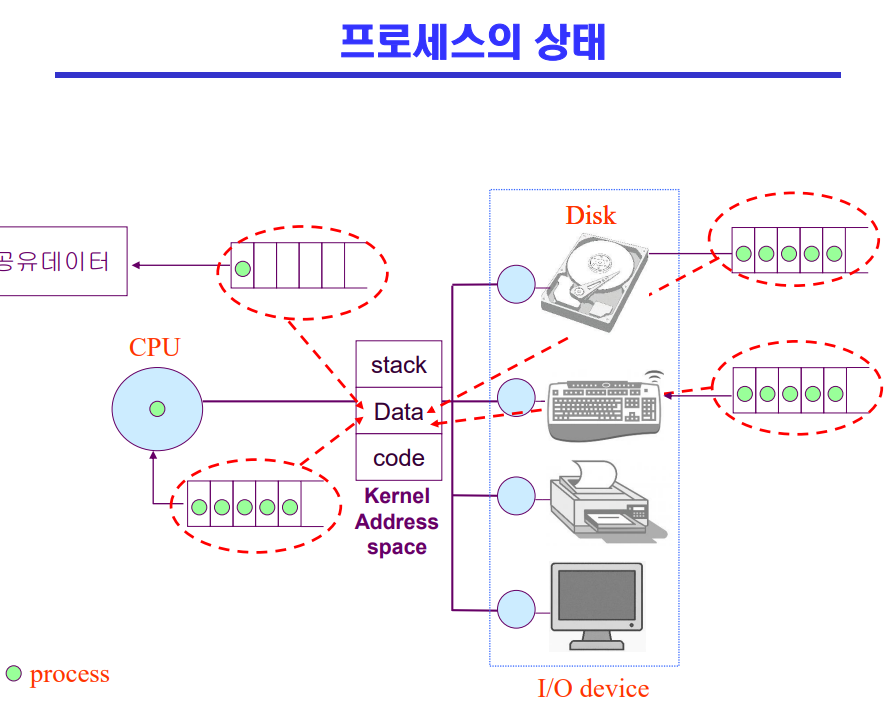
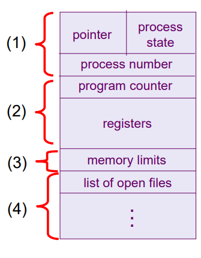
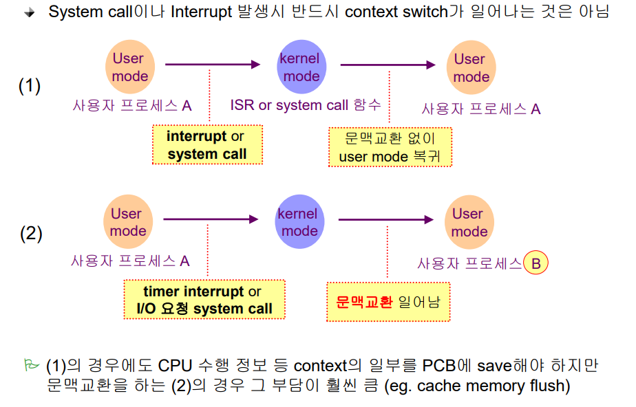
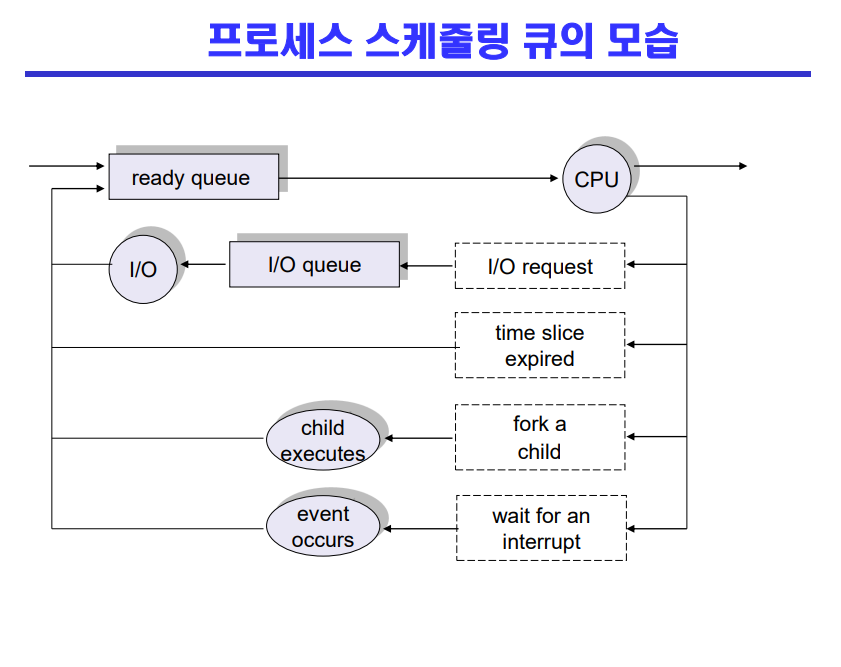

# Process

## 프로세스의 개념
- Process is a program in execution
- 실행 중인 프로그램

 

## 프로세스의 문맥(context)
- 특정 시점을 놓고 봤을 때 어디까지 실행을 했고 현재 상태가 어떠한가
- PC(program counter)가 어디를 가르키고 있는가
- CPU 수행 상태를 나타내는 하드웨어 문맥: Program Counter, 각종 register
- 프로세스의 주소 공간: code, data, stack
- 프로세스 관련 커널 자료 구조: PCB(Process Control Block), Kernel stack
- 왜 문맥을 알아야하냐?: 다음번에 CPU를 잡았을 때 다시 앞부분부터 실행시켜야하는 낭비가 생김, 바로 다음 시점부터 실행시키기 위함

 

## 프로세스의 상태(Process State)
- 프로세스는 상태(state)가 변경되며 수행된다
  - Running
    - CPU를 잡고 instruction을 수행중인 상태
  - Ready 
    - CPU를 기다리는 상태(메모리 등 다른 조건을 모두 만족하고)
  - Blocked(wait,sleep): 
    - CPU를 주어도 instruction을 수행할 수 없는 상태
    - Process 자신이 요청한 event(예: I/O)가 즉시 만족되지 않아 이를 기다리는 상태
    - ex: 디스크에서 file을 읽어와야 하는 경우
  - Suspended(stopped)
    - 외부적인 이유로 프로세스의 수행이 정지된 상태
    - 프로세스는 통째로 디스크에 swap out 된다
    - ex: 사용자가 프로그램을 일시 정지시킨 경우(break key), 시스템이 여러 이유로 프로세스를 잠시 중단 시킴(메모리에 너무 많은 프로세스가 올라와 있을 때)
  - New: 프로세스가 생성중인 상태
  - Terminated: 수행(execution)이 끝난 상태
  - Blocoked: 자신이 요청한 event가 만족되면 Ready
  - Suspended: 외부에서 resume해 주어야 Active

 

## Process Control Bloack(PCB)
- PCB
  - 운영체제가 각 프로세스를 관리하기 위해 프로세스당 유지하는 정보
  - 다음의 구성 요솔르 가진다(구조체로 유지)
    - (1) OS가 관리상 사용하는 정보
      - Precess state(Ready, Blocked), Process ID(주민번호)
      - scheduling information, priority
    - (2) CPU 수행 관련 하드웨어 값
      - Program counter, registers
    - (3) 메모리 관련
      - Code, data, stack의 위치 정보
    - (4) 파일 관련
      - Open file descriptors
  
  

 

## 문맥 교환(context switch)
- CPU를 한 프로세스에서 다른 프로세스로 넘겨주는 과정
- CPU가 다른 프로세스에게 넘어갈 때 운영체제는 다음을 수행
  - CPU를 내어주는 프로세스의 상태를 그 프로세스의 PCB에 저장
  - CPU를 새롭게 얻는 프로세스의 상태를 PCB에서 읽어옴
- System call이나 Interrupt 발생시 반드시 context switch가 일어나는 것은 아님

 

## 프로세스를 스케줄링하기 위한 큐
- Job queue: 현재 시스템 내에 있는 모든 프로세스의 집합
- Ready queue: 현재 메모리 내에 있으면서 CPU를 잡아서 실행되기를 기다리는 프로세스의 집합
- Device queues: I/O device의 처리를 기다리는 프로세스의 집합
- 프로세스들은 각 큐들을 오가며 수행된다

 

## 스케줄러(Scheduler)
- Long-term scheduler(장기 스케줄러 or job scheduler)
  - 시작 프로세스 중 어떤 것들을 ready queue로 보낼지 결정
  - 프로세스에 memory(및 각종 자원)을 주는 문제
  - degree of Multiprogramming을 제어
  - time sharing system에는 보통 장기 스케줄러가 없음(무조건 ready)

- Short-term scheduler(단기 스케줄러 or CPU scheduler)
  - 어떤 프로스세를 다음번에 running시킬지 결정
  - 프로세스에 CPU를 주는 문제
  - 충분히 빨라야함 (millisecond 단위)

- Medium-Term Schduler(중기 스케줄러 or Swapper)
  - 여유 공간 마련을 위해 프로세스를 통째로 메모리에서 디스크로 쫓아냄
  - 프로세스에게서 memory를 뺏는 문제
  - degree of Multiprogramming을 제어

## 질문
1. Blocked랑 suspended의 차이를 말해보시오
2. 문맥교환이란?