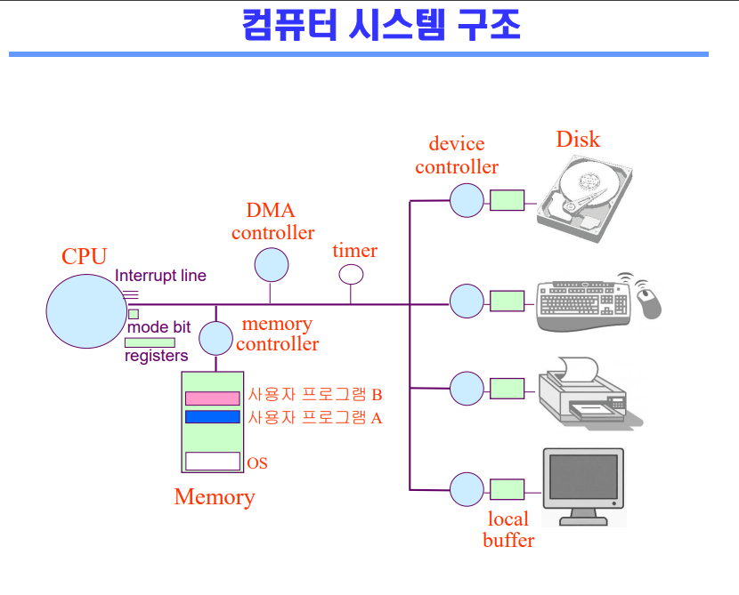
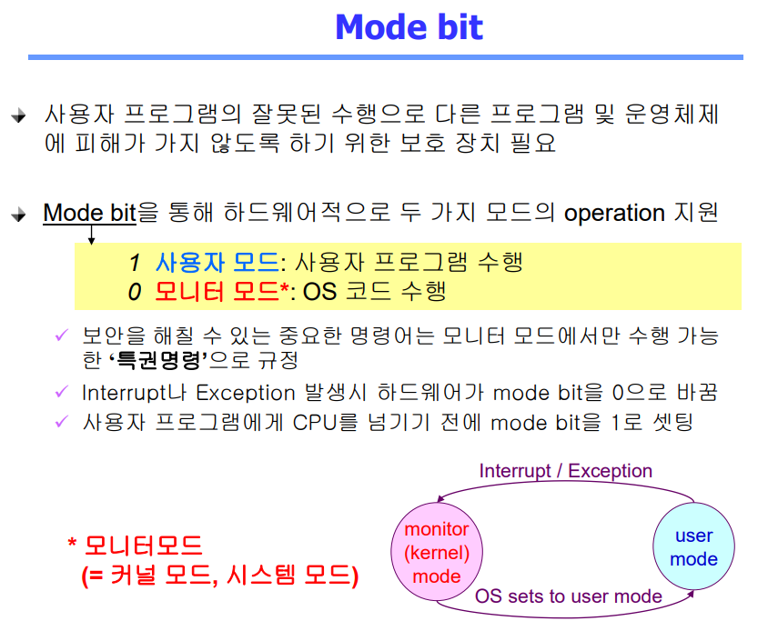
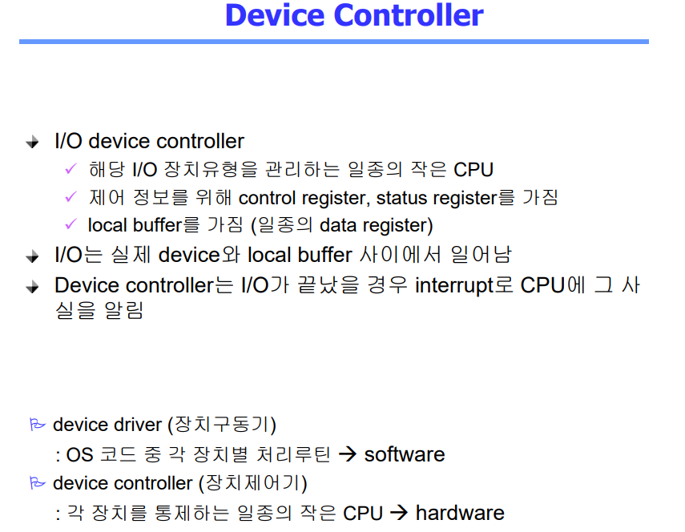
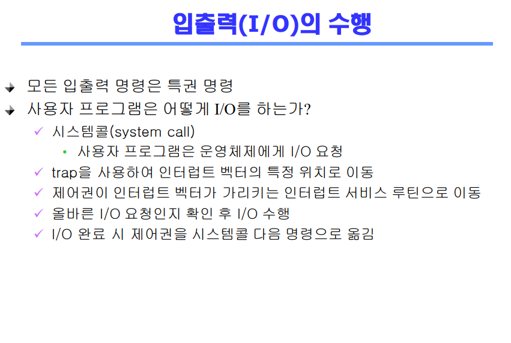
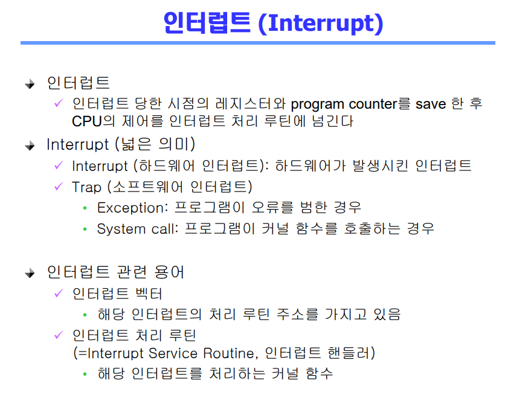

# System Structure & Program Execution

## 컴퓨터 시스템 구조
- 컴퓨터: CPU + Memory

- 각 기기마다의 작업공간 -> local buffer
- CPU: registers + mode bit(운영체제인지? 사용자 프로그램인지?) + Interrupt line
- CPU => Memory(사용자 프로그램A) => IO 컨트롤러에게 disk를 읽으라고 일을 시킴 => disk를 읽음 => Interrupt line
- Timer: 특정 프로그램이 CPU를 독점하는 것을 막기 위함

 

## Mode bit
- 두 가지 모드의 operation 지원
  - 1 사용자 모드: 사용자 프로그램 수행
  - 0 모니터 모드: OS코드 수행
  - 모니터 모드(=커널 모드, 시스템 모드)
- 보안을 해칠 수 있는 중요한 명령어는 모니터 모드에서만 수행 가능한 **'특권명령'**으로 규정

 

## Timer
- 정해진 시간 흐른 뒤 운영체제에게 제어권이 넘어가도록 인터럽트를 발생시킴

 

## Device Controller
- I/O device controller
  - 해당 I/O 장치유형을 관리하는 일종의 작은 CPU
  - 제어 정보를 위해 control register, status register를 가짐

 

## DMA controller
- 중간중간에 들어오는 local buffer에 있는 작업들을 복사해서 Memory에 놓고 Interrupt를 건다
- Interrupt의 빈도를 줄이기

- I/O 요청 하기 위해 운영체제 호출 => system call
- 프로그램이 Interrupt를 걸 수 있음 => mode bit 0 => 운영체제

 

## 인터럽트

 

## 시스템콜
- 사용자 프로그램이 운영체제의 서비스를 받기 위해 커널 함수를 호출

 

## 문제
1. CPU가 Disk를 읽는 과정을 말해보시오
2. Timer가 있는 이유가 무엇인지?
3. 하드웨어 인터럽트와 소프트웨어 인터럽트의 차이를 말해보시오