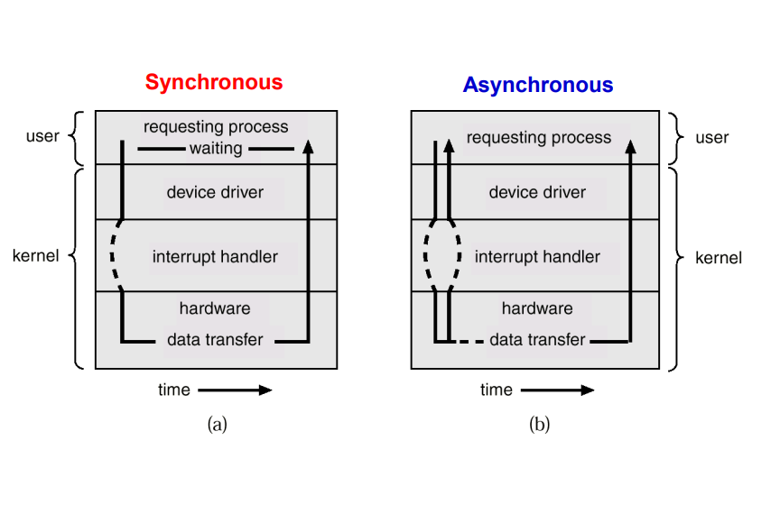
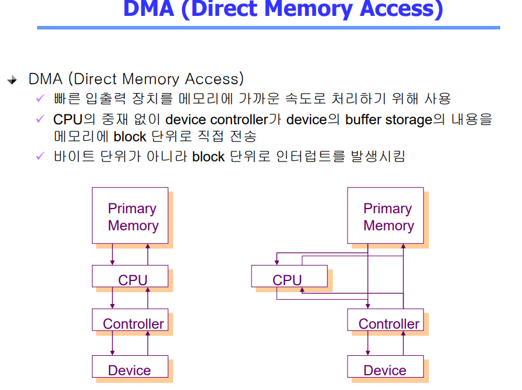
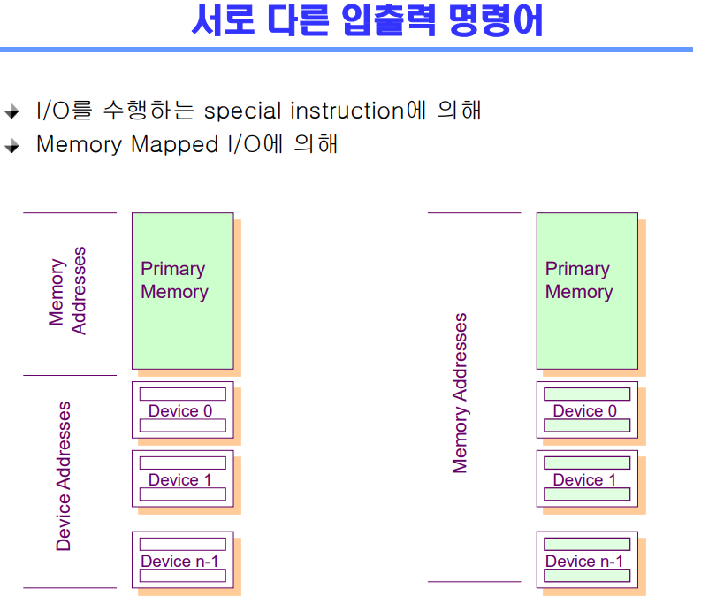
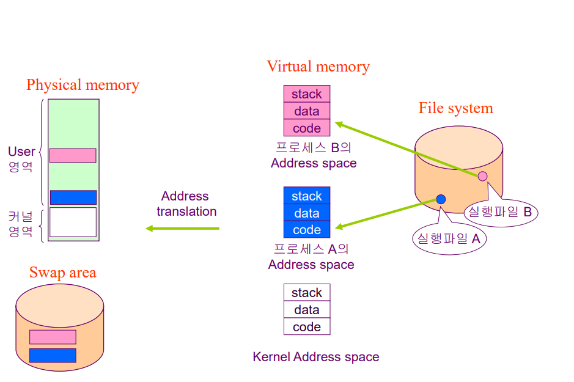
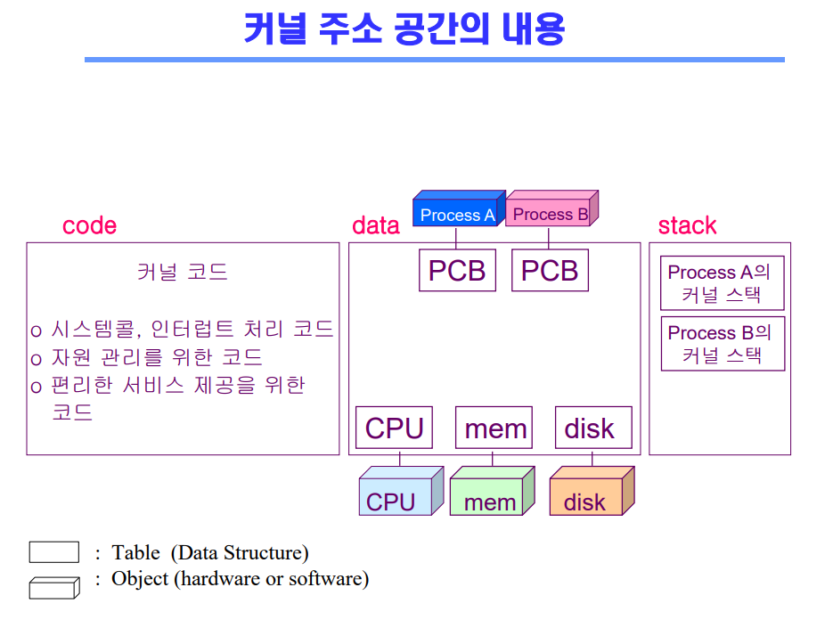
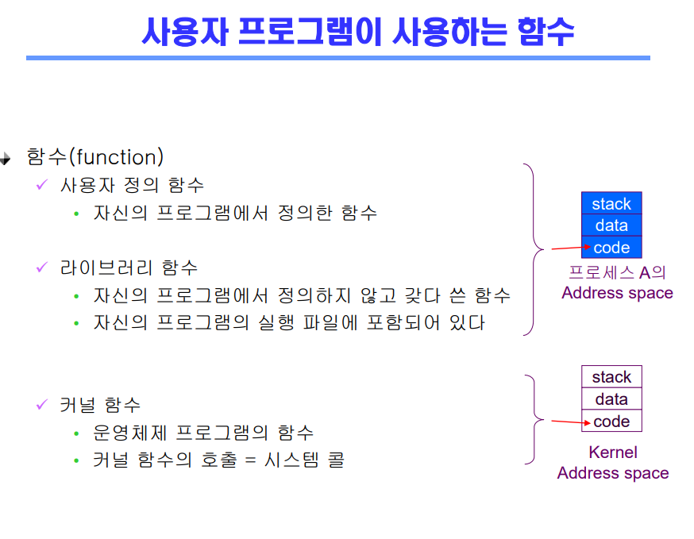

# Introduction to Operating Systems2

## 컴퓨터 시스템 구조
- 메모리의 다음 인스트럭션 => 인스트럭션
- 단, 제어구조에 따라 점프 및 가능
- 일을 하고나서 => 인터럽트 확인

 

## 동기식 입출력과 비동기식 입출력
- 동기식 입출력(synchronous I/O)
  - I/O 요청 후 입출력 작업이 완료된 후에야 제어가 사용자 프로그램에 넘어가
  - 구현 방법 1
    - I/O가 끝날 때까지 CPU를 낭비시킴
    - 매시점 하나의 I/O만 일어날 수 있음
  - 구현 방법2
    - I/O가 완료될 때까지 해당 프로그램에게서 CPU를 빼앗음
    - I/O 처리를 기다리는 중에 그 프로그램을 줄 세움
    - 다른 프로그램에게 CPU를 줌

- 비동기식 입출력(asynchronous I/O)
  - I/O가 시작된 후 입출력 작업이 끝나기를 기다리지 않고 제어가 사용자 프로그램에 즉시 넘어감

- 두 경우 모두 I/O의 완료는 인터럽트로 알려줌

 

## DMA
- 빠른 입출력 장치를 메모리에 가까운 속도로 처리하기 위해 사용
- CPU의 중재 없이 device controller과 device의 buffer storage의 내용을 메모리에 block 단위로 직접 전송
- 바이트 단위가 아니라 block 단위로 인터럽트를 발생시킴
- 인터럽트를 줄이기 위함

 

## 서로 다른 입출력 명령어
- 메모리를 접근하는 인스트럭션
- I/O 디바이스를 접근하는 인스트럭션
- I/O 디바이스에 메모리 주소를 붙혀서 하는 Memory Mapped I/O

 

## 저장장치 계층 구조

## 프로그램의 실행(메모리 load)
- 주소 공간
  - code: 프로그램 기계어 코드
  - data: 변수, 전역 변수, 프로그램이 사용하는 자료구조
  - stack: 함수 호출하거나 리턴 할 때 쌓는 곳
- 가상 메모리
  - 각 프로그램마다 주소 공간

 

## 커널 주소 공간의 내용
- 커널 코드
  - 시스템콜, 인터럽트 처리 코드
  - 자원 관리를 위한 코드
  - 편리한 서비스 제공을 위한 코드
- data
  - 프로그램마다 pcb가 만들어져서 관리
- stack
  - 함수 호출하거나 리턴 하는 코드를 쌓는 곳
  - 사용자 프로세스마다 별도로 쌓는다

 

## 사용자 프로그램이 사용하는 함수
- 함수
  - 사용자 정의 함수
    - 자신의 프로그램에서 정의한 함수
  - 라이브러리 함수
    - 자신의 프로그램에서 정의하지 않고 갖다 쓴 함수
    - 자신의 프로그램의 실행 파일에 포함되어 있다
  - 커널 함수
    - 운영체제 프로그램의 함수
    - 커널 함수의 호출 = 시스템 콜

 

## 문제
1. 동기식 입출력과 비동기식 입출력의 차이점을 말해보시오
2. DMA의 존재 의미를 말해보시오
3. Memory Mapped I/O에 대해 말해보시오