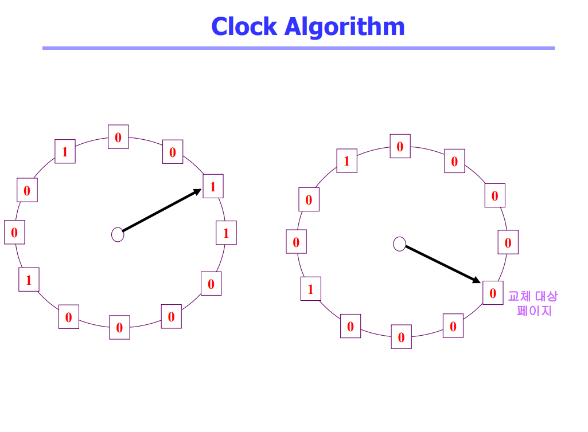
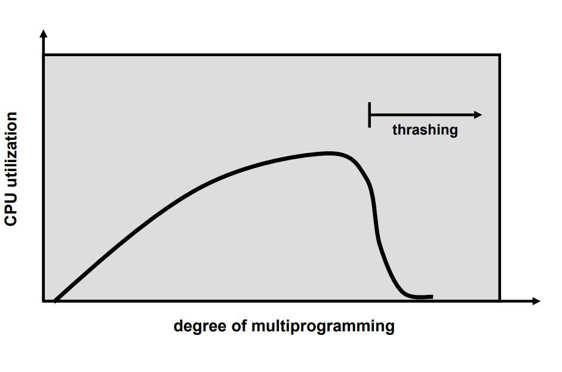
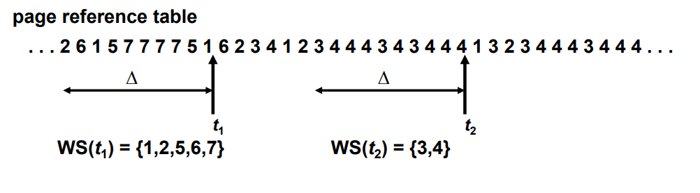
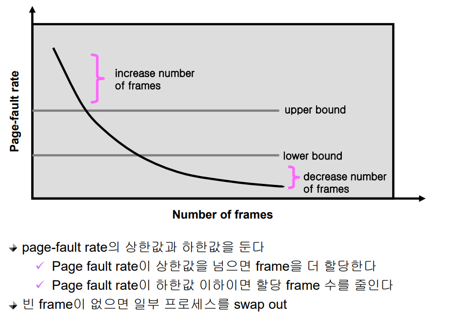
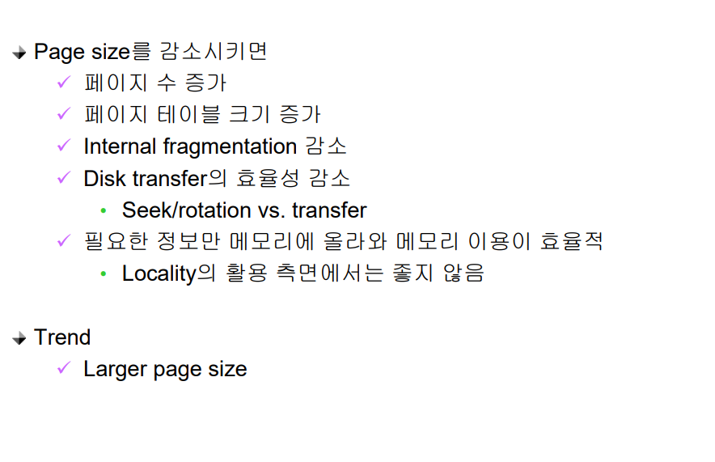

# Virtual Memory 2

## 다양한 캐슁 환경
- 캐슁 기법
  - paging system처럼 한정된 빠른 저장 공간을 가지고 계속적으로 요청되는 새로운 객체를 저장 공간에 읽어들였다가 후속 요청시 직접 서비스하는 방식을 캐슁(caching) 기법이라 하고 저장 공간을 캐쉬라고 부름
- 캐슁 기법은 우리가 배우고 있는 paging system 외에도 cache memory, buffer caching, Web caching 등 다양한 분야에서 사용

- 캐쉬 운영의 시간 제약
  - 교체 알고리즘에서 삭제할 객체를 결정하는 일에 지나치게 많은 시간이 걸리는 경우 실제 시스템에서 사용할 수 없음
  - Buffer caching이나 Web caching의 경우
    - O(1)에서 O(log n) 정도까지 허용
  - Paging system인 경우
    - 페이지 요청이 너무 빈번하여 O(1)인 LRU 알고리즘의 list 조작도 부담

## Clock Algorithm
- Clock algorithm
  - LRU의 근사(approximation) 알고리즘
  - 여러 명칭으로 불림
    - Second chance algorithm
    - NUR (Not Used Recently) 또는 NRU (Not Recently Used)
  - Reference bit을 사용해서 교체 대상 페이지 선정 (circular list)
  - reference bit가 0인 것을 찾을 때까지 포인터를 하나씩 앞으로 이동
  - 포인터 이동하는 중에 reference bit 1은 모두 0으로 바꿈
  - Reference bit이 0인 것을 찾으면 그 페이지를 교체
  - 한 바퀴 되돌아와서도(=second chance) 0이면 그때에는 replace 당함
  - 자주 사용되는 페이지라면 second chance가 올 때 1

- Clock algorithm의 개선
  - reference bit과 modified bit (dirty bit)을 함께 사용
  - reference bit = 1 : 최근에 참조된 페이지
  - modified bit = 1 : 최근에 변경된 페이지 (I/O를 동반하는 페이지)

## Page Frame의 Allocation
- Allocation problem: 각 process에 얼마만큼의 page frame을 할당할 것인가? 
- Allocation의 필요성
  - 메모리 참조 명령어 수행시 명령어, 데이터 등 여러 페이지 동시 참조
    - 명령어 수행을 위해 최소한 할당되어야 하는 frame의 수가 있음
  - Loop를 구성하는 page들은 한꺼번에 allocate 되는 것이 유리함
    - 최소한의 allocation이 없으면 매 loop 마다 page fault
- Allocation Scheme
  - Equal allocation: 모든 프로세스에 똑 같은 갯수 할당
  - Proportional allocation: 프로세스 크기에 비례하여 할당
  - Priority allocation: 프로세스의 priority에 따라 다르게 할당

## Global vs. Local Replacement 
- Global replacement
  - Replace 시 다른 process에 할당된 frame을 빼앗아 올 수 있다
  - Process별 할당량을 조절하는 또 다른 방법임
  - FIFO, LRU, LFU 등의 알고리즘을 global replacement로 사용시에 해당
  - Working set, PFF 알고리즘 사용
- Local replacement
  - 자신에게 할당된 frame 내에서만 replacement 
  - FIFO, LRU, LFU 등의 알고리즘을 process 별로 운영시

## Thrashing
- Thrashing
  - 프로세스의 원활한 수행에 필요한 최소한의 page frame 수를 할당 받지 못한 경우 발생
  - Page fault rate이 매우 높아짐
  - CPU utilization이 낮아짐
  - OS는 MPD (Multiprogramming degree)를 높여야 한다고 판단
  - 또 다른 프로세스가 시스템에 추가됨 (higher MPD)
  - 프로세스 당 할당된 frame의 수가 더욱 감소
  - 프로세스는 page의 swap in / swap out으로 매우 바쁨
  - 대부분의 시간에 CPU는 한가함
  - low throughput

## Working-Set Model
- Locality of reference
  - 프로세스는 특정 시간 동안 일정 장소만을 집중적으로 참조한다
  - 집중적으로 참조되는 해당 page들의 집합을 locality set이라 함

- Working-set Model
  - Locality에 기반하여 프로세스가 일정 시간 동안 원활하게 수행되기 위해 한꺼번에 메모리dp 올라와 있어야 하는 page들의 집합을 Working Set 이라 정의함
  - Working Set 모델에서는 process의 working set 전체가 메모리에 올라와 있어야 수행되고 그렇지 않을 경우 모든 frame을 반납한 후 swap out (suspend) 
  - Thrashing을 방지함
  - Multiprogramming degree를 결정함

## Working-Set Algorithm
- Working set의 결정
  - Working set window를 통해 알아냄
  - window size가 델타인 경우
    - 시각 ti 에서의 working set WS (ti) 
    – Time interval [ti-데타, ti] 사이에 참조된 서로 다른 페이지들의 집합
  - Working set에 속한 page는 메모리에 유지, 속하지 않은 것은 버림(즉, 참조된 후 델타 시간 동안 해당 page를 메모리에 유지한 후 버림) 
- Working-Set Algorithm
  - Process들의 working set size의 합이 page frame의 수보다 큰 경우
    - 일부 process를 swap out시켜 남은 process의 working set을 우선적으로 충족시켜 준다 (MPD를 줄임)
  - Working set을 다 할당하고도 page frame이 남는 경우
    - Swap out 되었던 프로세스에게 working set을 할당 (MPD를 키움)

## PFF (Page-Fault Frequency) Scheme

## Page Size의 결정

## 질문
1. Clock 알고리즘과 LRU의 성능 차이는 무엇이며, 왜 실제 OS는 LRU 대신 Clock을 선호합니까?
2. 